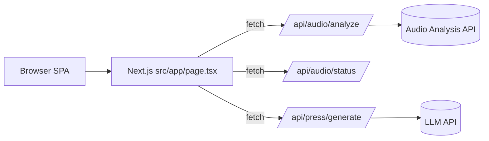
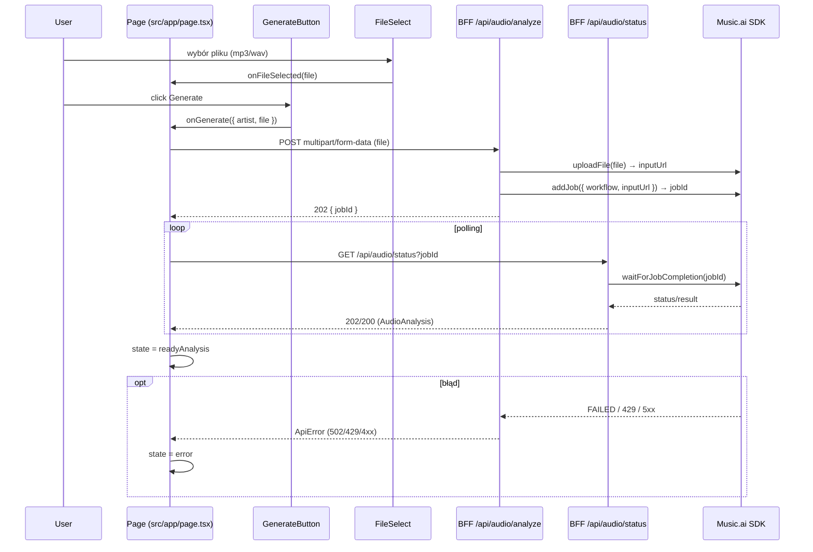
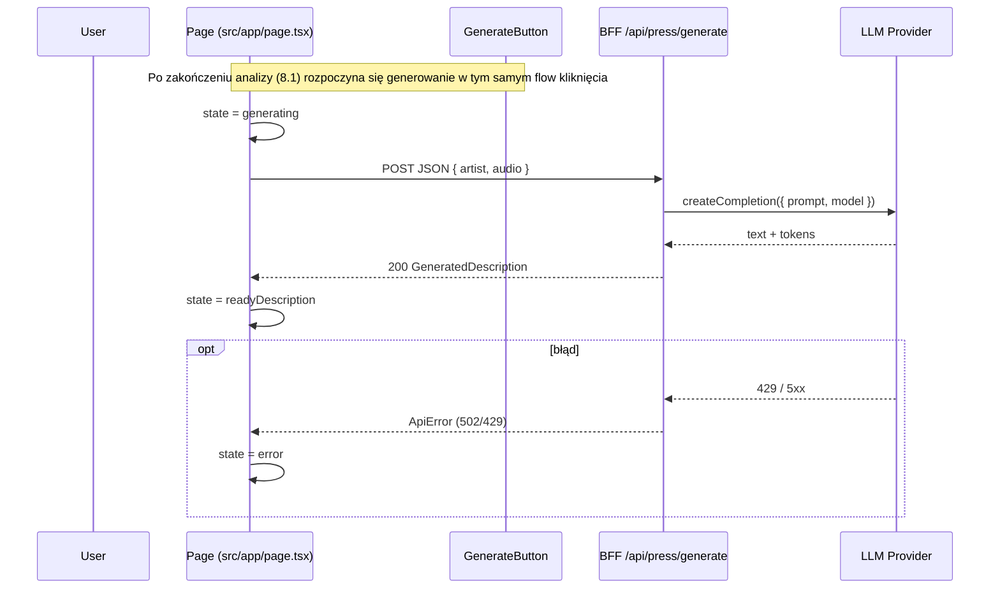
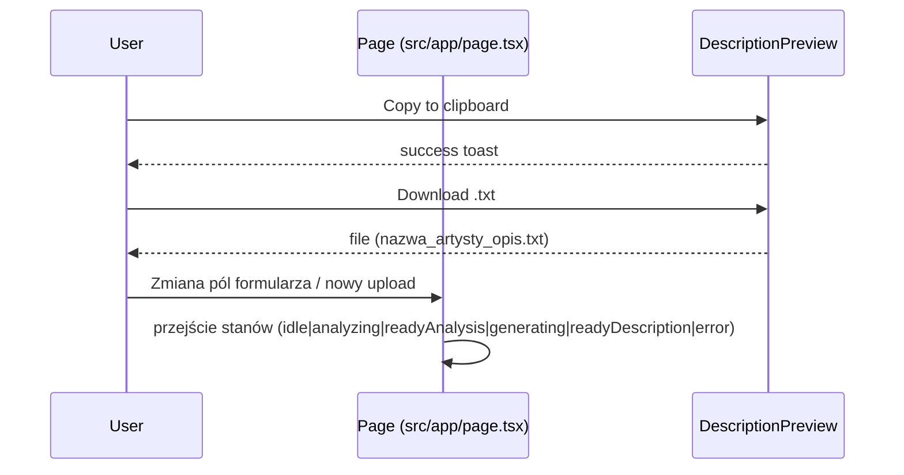
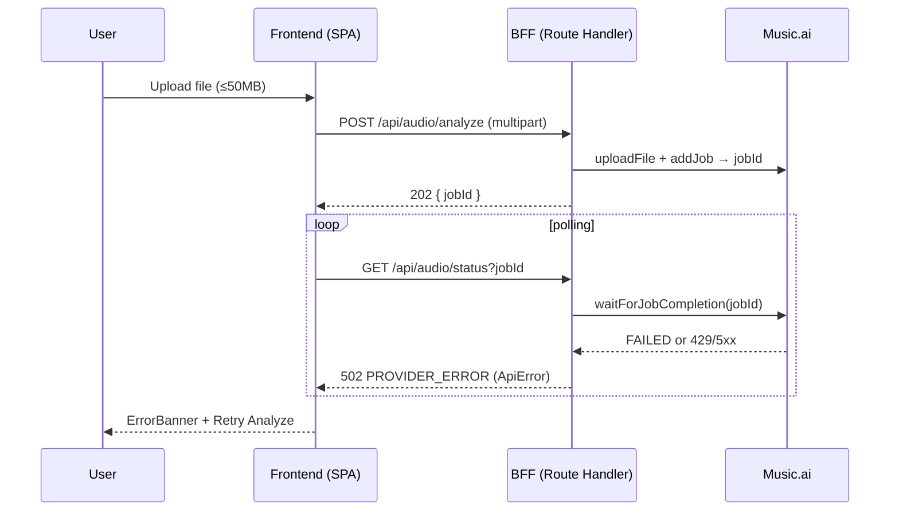
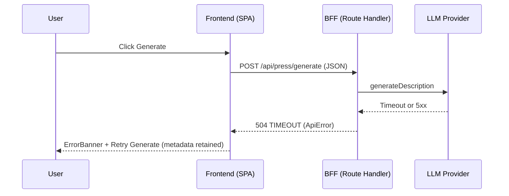

# Fullstack Architecture Document: Artist Amplifier (MVP)

Odniesienia: `docs/prd.md` (MVP, NFR), `docs/brief.md`

## Change Log

| Data       | Wersja | Opis                                          | Autor               |
| :--------- | :----- | :-------------------------------------------- | :------------------ |
| 24.08.2025 | 0.1    | Utworzenie szkieletu dokumentu + Introduction | Winston (Architect) |

---

## 1. Introduction

Ten dokument definiuje pełnostosową (full‑stack) architekturę dla projektu Artist Amplifier jako MVP typu single‑page, single‑screen. Celem jest dostarczenie jednego, mierzalnego rezultatu: edytowalnego opisu prasowego na podstawie minimalnych danych artysty i pojedynczego pliku audio.

- UI pozostaje responsywne; wskaźniki postępu dla analizy audio i generowania tekstu. Brak twardego limitu czasu po stronie UI (NFR1) — analiza może trwać do kilku minut; realizujemy analizę jako zadanie asynchroniczne (submit + polling w BFF).
- Prywatność: brak logowania i baz użytkowników; brak trwałego przechowywania danych. Wszystkie dane przetwarzane w pamięci/tymczasowo i usuwane po sesji (NFR2).
- Użyteczność: cały przepływ na jednym ekranie (single page, single screen) (NFR3).
- Kompatybilność: przyjmowane formaty .mp3/.wav do 50 MB; walidacja i czytelne komunikaty błędów (NFR4).
- Integracje zewnętrzne (analiza audio, LLM): bezpośrednio z klienta, gdy bezpieczne; minimalny BFF wyłącznie jeśli konieczny (ochrona kluczy, CORS, limity). Zasada YAGNI.

Starter Template / Existing Project: N/A — Greenfield project.

---

## 2. High Level Architecture

Wybór: Next.js (App Router) jako frontend + minimalny BFF (Route Handlers) w jednym repo. Single‑screen SPA bez SSR (komponenty klienckie), a BFF obsługuje sekrety, CORS, rate‑limiting i streaming do UI.

### 2.1. Technical Summary

- Frontend: Next.js (App Router) + TypeScript + Tailwind. Jeden ekran (`src/app/page.tsx`), brak SSR (client components) dla prostoty.
- BFF: Next.js Route Handlers (`src/app/api/.../route.ts`) uruchamiane na Vercel (Node/Edge) do: ukrycia kluczy, CORS, rate‑limiting i streaming.
- Integracje: zewnętrzne API analizy audio oraz LLM do generowania tekstu.
- Prywatność: brak auth i trwałego storage’u (dane tymczasowe/in‑memory zgodnie z NFR2).
- Wydajność/UX: stany progresu (analyzing/generating) prezentowane na przycisku; brak twardego limitu czasu po stronie UI; analiza audio realizowana asynchronicznie (submit + poll).

### 2.2. Platform and Infrastructure Choice

- Opcja A: Statyczne SPA bez BFF
  - Plusy: najprostsze, najmniej kodu.
  - Minusy: ekspozycja sekretów, problemy CORS/limity, brak streamingu.
- Opcja B: Next.js + Vercel Functions/Edge (REKOMENDACJA)
  - Plusy: wbudowane API routes (BFF), łatwy deploy, sekrety jako env, streaming, kontrola CORS/limitów.
  - Minusy: minimalnie większa złożoność niż czyste SPA.
- Opcja C: Cloudflare Pages + Workers
  - Plusy: edge performance, darmowy tier.
  - Minusy: specyfika platformy, dodatkowe dopasowania.

### 2.3. Repository Structure

Jedno repo Next.js (FE + BFF razem). Opcjonalnie `packages/shared` na typy/utilsy współdzielone.

### 2.4. High Level Architecture Diagram (Mermaid)



### 2.5. Architectural Patterns

- Jamstack + minimalny BFF (Route Handlers) zamiast pełnego backendu.
- FE: service layer dla wywołań HTTP; komponenty prezentacyjne bezpośrednio nie wywołują API.
- BE: standardowy format błędów, walidacja wejścia, rate‑limit na endpointach, możliwość streamingu z LLM.
- YAGNI: tylko konieczne endpointy (`/api/audio/analyze`, `/api/audio/status`, `/api/press/generate`).

---

## 3. Tech Stack

Krótki szkielet tabeli (pełna tabela w `docs/architecture/tech-stack.md`).

| Category                   | Technology                               | Version      | Purpose                   | Rationale                 |
| -------------------------- | ---------------------------------------- | ------------ | ------------------------- | ------------------------- |
| Frontend Framework         | Next.js (App Router)                     | 15.x         | SPA (single‑screen)       | FE+BFF w jednym projekcie |
| Backend (BFF – opcjonalny) | Next.js Route Handlers (Vercel)          | Node 22.18.0 | Proxy/keys/CORS/streaming | Bezpieczeństwo i prostota |
| API Style                  | REST (JSON)                              | -            | Integracje                | Najprostszy kontrakt      |
| File Storage (tymczasowe)  | Brak trwałego storage; ewent. signed URL | -            | Upload                    | Zgodność z NFR2           |

---

## 4. Data Models

Minimalne interfejsy TypeScript (MVP). Współdzielone typy umieszczamy w `src/lib/types.ts` (ew. później w `packages/shared`).

```ts
export type SupportedAudioMime = 'audio/mpeg' | 'audio/wav';
export type UILanguage = 'pl' | 'en';

export interface ArtistInput {
	artistName: string;
	artistDescription: string; // wymagane, 50–1000 znaków
	language?: UILanguage; // opcjonalne, domyślnie 'pl'
	// Atrybuty pliku (plik wysyłamy do /api/audio/analyze jako FormData)
	audioFileName: string;
	audioMimeType: SupportedAudioMime;
	audioSizeBytes: number; // ≤ 50 MB
}

export interface AudioAnalysis {
	durationSec: number;
	bpm?: number;
	musicalKey?: string; // np. "C", "Am"
	energy?: number; // 0..1
}

export interface GeneratedDescription {
	language: UILanguage;
	text: string;
	outline?: string[];
	modelName?: string;
	tokensUsed?: number;
}

export interface ApiError {
	error: {
		code: string;
		message: string;
		details?: Record<string, any>;
		timestamp: string;
		requestId: string;
	};
}
```

---

## 5. API Specification

Kontrakty REST (Next.js Route Handlers w `src/app/api/.../route.ts`). Integracja z Music.ai przez SDK `@music.ai/sdk`. Streaming dla LLM – domyślnie OFF (pełna odpowiedź JSON).

### 5.1 POST `/api/audio/analyze`

- Wejście: `multipart/form-data` z polem `file` (`.mp3/.wav`, ≤ 50 MB)
- Backend (BFF):

  1. Waliduje typ/rozmiar.
  2. Zapisuje plik tymczasowo (np. `/tmp`) lub buforuje w pamięci.
  3. `uploadFile(...)` z SDK → `inputUrl`.
  4. `addJob({ name, workflow: process.env.MUSIC_AI_WORKFLOW_ANALYZE, params: { inputUrl } })` → `jobId`.
  5. Zwraca `202 Accepted` z `jobId` (analiza wykonywana asynchronicznie po stronie dostawcy). FE będzie odpytywać endpoint statusu.

- Sukces 202 (application/json):

```json
{ "jobId": "mai_job_123" }
```

- Błędy: 400 (walidacja), 413 (za duży plik), 415 (typ), 429 (rate limit), 5xx (błąd zewn./wewn.).
- ENV: `MUSIC_AI_API_KEY`, `MUSIC_AI_WORKFLOW_ANALYZE` (identyfikator/nazwa workflow z panelu Music.ai).

### 5.2 GET `/api/audio/status`

- Zapytanie: `GET /api/audio/status?jobId=mai_job_123`
- Backend (BFF):

  1. Odczytuje `jobId` i woła `waitForJobCompletion(jobId)` z rozsądnym limitem pollingu.
  2. Gdy `SUCCEEDED`: mapuje wynik na `AudioAnalysis` i zwraca 200 JSON.
  3. Gdy `FAILED`: zwraca `502` w standardzie `ApiError`.
  4. Gdy analiza w toku: zwraca `202 Accepted` (opcjonalnie z krótkim statusem).

- Sukces 200 (application/json):

```json
{
	"durationSec": 187.5,
	"bpm": 120,
	"musicalKey": "Am",
	"energy": 0.72
}
```

### 5.3 POST `/api/press/generate`

- Wejście: `application/json`

```json
{
	"artist": {
		"artistName": "Example",
		"artistDescription": "Krótki opis artysty (50–1000 znaków)",
		"language": "pl",
		"audioFileName": "track.mp3",
		"audioMimeType": "audio/mpeg",
		"audioSizeBytes": 1234567
	},
	"audio": {
		"durationSec": 187.5,
		"bpm": 120,
		"musicalKey": "Am",
		"energy": 0.72
	}
}
```

- Sukces 200 (application/json):

```json
{
	"language": "pl",
	"text": "Wygenerowany opis...",
	"outline": ["..."],
	"modelName": "gpt-4o-mini",
	"tokensUsed": 1024
}
```

- Streaming: OFF domyślnie. Opcjonalnie do rozważenia później (SSE `text/event-stream`).
- Błędy: 400/429/5xx (format jak `ApiError`).

### 5.3 Standard błędów (BE → FE)

```ts
interface ApiError {
	error: {
		code: string;
		message: string;
		details?: Record<string, any>;
		timestamp: string;
		requestId: string;
	};
}
```

### 5.4 Uwagi implementacyjne

- Analiza audio realizowana asynchronicznie: nie blokujemy requestu do czasu zakończenia joba.
- `/api/audio/analyze` zwraca `202 { jobId }`; postęp sprawdzany przez `/api/audio/status` (polling po stronie FE).
- Brak trwałego storage; dane tymczasowe tylko na czas żądania.
- Utrzymuj limity rozmiaru i typów plików zarówno na FE, jak i BE.

---

## 6. Components

Przejrzysta lista komponentów i odpowiedzialności (MVP, single screen, brak storage, streaming OFF).

### 6.1 Frontend (React, Next.js App Router)

- **`src/app/page.tsx` (AppShell/Screen)`**

  - Składa cały ekran. Trzyma prostą maszynę stanów (`useReducer`).
  - Stany: `idle → analyzing → readyAnalysis → generating → readyDescription` (oraz `error`).
  - Orkiestruje wywołania do service layer.

- **`src/components/ArtistForm.tsx`**

  - Pola: `artistName` (wym.) oraz `artistDescription` (wym., textarea 50–1000 z licznikiem).
  - Walidacje: wymagane `artistName` i `artistDescription` (limity znaków).
  - Język UI/wyniku: domyślnie `pl` (brak selektora języka w MVP).

- **`src/components/FileUpload.tsx`**

  - Drag&drop + przycisk wybierz plik.
  - Walidacja typu (`audio/mpeg|audio/wav`) i rozmiaru (≤ 50 MB) przed wysyłką.

- **`src/components/AnalysisStatus.tsx`**

  - Status tekstowy etapu (bez paska postępu): „Analiza audio…” / „Generowanie…”.

- **`src/components/DescriptionPreview.tsx`**

  - Prezentacja `GeneratedDescription` (tekst + opcjonalny `outline`).
  - Akcje: kopiuj do schowka, pobierz `.txt` (`DownloadTxtButton`).

- **`src/components/ErrorBanner.tsx`**

  - Standardowe wyświetlanie `ApiError`.

- **`src/components/GenerateButton.tsx`**

	- Pojedynczy przycisk uruchamiający analizę audio, a następnie generowanie (jeden klik).
	- W trakcie pracy sam prezentuje status: „Analiza audio…” → „Generowanie…”.
	- Aktywny, gdy formularz (Story 1.1) jest poprawny i wskazano plik audio (Story 1.2). Nie wymaga wcześniejszego stanu `readyAnalysis`.
	- W razie błędu analizy/generowania pokazuje komunikat i umożliwia ponowienie po poprawkach.

- **Service layer (FE)**
  - `src/lib/api/audio.ts` → `startAudioAnalysis(formData: FormData): Promise<{ jobId: string }>`
  - `src/lib/api/audio.ts` → `getAudioStatus(jobId: string): Promise<AudioAnalysis | { status: 'processing' }>`
  - `src/lib/api/press.ts` → `generatePress(body: { artist: ArtistInput; audio: AudioAnalysis }): Promise<GeneratedDescription>`
  - `src/lib/validators.ts` → walidacje typu/rozmiaru audio.
  - `src/lib/types.ts` → współdzielone interfejsy (sekcja 4).

### 6.2 Backend (BFF – Next.js Route Handlers)

- **`src/app/api/audio/analyze/route.ts`**

  - Przyjmuje `multipart/form-data` (`file`).
  - Waliduje typ i rozmiar, wykonuje `uploadFile` → `addJob` i zwraca `202 Accepted` z `{ jobId }` (bez oczekiwania na wynik).
  - Zwraca `202 { jobId }` lub `ApiError` (400/413/415/429/5xx).

- **`src/app/api/audio/status/route.ts`**

  - Przyjmuje `GET` z parametrem `jobId`.
  - Wywołuje `waitForJobCompletion(jobId)`; przy sukcesie mapuje wynik na `AudioAnalysis`.
  - Zwraca `202 Accepted` (w toku) lub `200 AudioAnalysis` (zakończone), w razie błędu `ApiError` (502/429/5xx).

- **`src/app/api/press/generate/route.ts`**

  - Przyjmuje JSON (`artist`, `audio`).
  - Wywołuje `llm.generateDescription(...)` (non‑stream). Zwraca `GeneratedDescription`.

- **Warstwa integracyjna (BE)**
  - `src/lib/server/musicai.ts`
    - `uploadFile(...)`, `addJob(...)`, `waitForJobCompletion(...)`, `mapToAudioAnalysis(result)`; obsługa retry/backoff.
  - `src/lib/server/llm.ts`
    - Prosty klient do providera LLM (TBC) – non‑stream.
  - `src/lib/server/errors.ts`
    - Helpery do `ApiError`, mapowanie kodów/HTTP.
  - (opcjonalnie) `src/lib/server/rateLimit.ts`
    - Minimalny limiter (np. token bucket / per‑IP) – do rozważenia.

### 6.3 Komunikacja i kontrakty

- FE komunikuje się wyłącznie z `/api/...` (BFF). Brak bezpośrednich wywołań do Music.ai/LLM.
- Formaty żądań/odpowiedzi zgodne z sekcją 5. Typy z `src/lib/types.ts`.

### 6.4 Błędy i UX

- Jeden spójny `ApiError` na BE → wyświetlany przez `ErrorBanner`.
- Blokada przycisków w stanach pracy, wyraźne komunikaty i retry manualny.

### 6.5 Dostępność (A11y) i i18n (MVP)

- Label/aria dla inputów i przycisków; focus states; klawisz Enter/Space tam gdzie ma sens.
- `language` w `ArtistForm` steruje językiem wyniku; i18n UI minimalne (PL/EN copy w stałych).

---

## 7. External APIs

Zewnętrzne integracje obsługujemy wyłącznie z BFF (Route Handlers) — klucze nigdy nie trafiają do przeglądarki.

### 7.1 Music.ai — Audio Analysis

- **Dostęp**: SDK `@music.ai/sdk` (Node, w BFF). Auth przez `MUSIC_AI_API_KEY` (SDK dodaje nagłówki).
- **Workflow**: identyfikator przechowywany w `MUSIC_AI_WORKFLOW_ANALYZE` (ENV), aby móc zmieniać bez modyfikacji kodu.
- **Metody SDK używane**:
  - `uploadFile(localPathOrBuffer) → inputUrl`
  - `addJob({ name, workflow, params: { inputUrl } }) → jobId`
  - `waitForJobCompletion(jobId) → job` (status: `SUCCEEDED`/`FAILED`)
  - (opcjonalnie) `downloadJobResults(...)`
- **Kontrakt**: mapujemy `job.result` na `AudioAnalysis` (`durationSec`, `bpm?`, `musicalKey?`, `energy?`). Nazwy kluczy wyników zależą od konkretnego workflow — mapowanie zamykamy w warstwie BFF.
- **Limity/Timeouty**:
  - Wejście: `.mp3/.wav` ≤ 50 MB (walidujemy na FE i BE).
  - `waitForJobCompletion`: bez twardego limitu po stronie UI; FE stosuje polling z backoff i obsługuje dłuższe czasy (nawet kilka minut) zgodnie z możliwościami providera.
- **Błędy i mapowanie**:
  - `FAILED` → 502 (`code: MUSIC_AI_JOB_FAILED`, `details: { jobId }`).
  - 429/5xx z Music.ai → 502 lub 429 (zależnie od kontekstu), z `requestId` i krótkim komunikatem.
  - Nie ujawniamy surowych detali zewnętrznych w `message`; pełniejsze szczegóły tylko w logach serwera.
- **Retry/Backoff**: na 429/5xx max 2 próby z exponential backoff (np. 250 ms, 750 ms) w ramach budżetu czasu.
- **Dane**: brak trwałego storage; plik tylko tymczasowo (np. `/tmp`) na czas uploadu do Music.ai.

### 7.2 LLM — Text Generation (Provider TBC)

- **Dostęp**: provider do potwierdzenia (OpenAI‑compatible lub inny). Klucze w ENV (`LLM_API_KEY`).
- **Model**: `LLM_MODEL` w ENV (np. `gpt-4o-mini` lub inny odpowiednik). Możliwy parametr `temperature` (domyślnie umiarkowany).
- **Wywołanie**: endpoint JSON (non‑stream). Streaming OFF w MVP. BFF formułuje prompt z `ArtistInput` + `AudioAnalysis` i zwraca `GeneratedDescription`.
- **Błędy**: 429/5xx → mapowane na 502/429 w standardzie `ApiError`; logujemy `providerRequestId` jeśli dostępne.
- **Bezpieczeństwo**: klucz tylko w BFF; FE nigdy nie woła LLM bezpośrednio.

### 7.3 Zmienne środowiskowe (ENV)

- `MUSIC_AI_API_KEY` — klucz do Music.ai.
- `MUSIC_AI_WORKFLOW_ANALYZE` — identyfikator/nazwa workflow analizy audio.
- `LLM_API_KEY` — klucz do dostawcy LLM (TBC).
- `LLM_MODEL` — model LLM (TBC).

### 7.4 Obserwowalność i logowanie (minimalne)

- Logujemy: `requestId`, `jobId` (Music.ai), `workflow`, czasy: upload → job start → completion.
- Nie logujemy PII ani treści plików; tylko dane techniczne (np. rozmiar pliku, typ, czasy) i statusy.

### 7.5 Bezpieczeństwo i zgodność z MVP

- Klucze w BFF i w sekcjach Secret Manager (np. Vercel). Brak ekspozycji w kliencie.
- Brak trwałego storage; dane przetwarzane w pamięci/tymczasowo.
- Proste, klarowne komunikaty błędów na FE; pełniejsze detale tylko w logach BE.

---

## 8. Core Workflows (Mermaid Sequence)

### 8.1 Analyze Audio (Music.ai, async job + polling)



### 8.2 Generate Press Note (LLM, non‑stream)



### 8.3 Copy/Download & Edit loop



---

## 9. Database Schema

MVP bez jakiejkolwiek bazy danych ani cache. Brak trwałego przechowywania danych.

### 9.1 Założenia

- Brak przechowywania PII oraz plików audio.
- Dane przetwarzane wyłącznie w trakcie obsługi żądania (request-scope).
- Brak KV/Redis i brak lokalnych cache metadanych w MVP.

### 9.2 Retencja i prywatność

- Po zakończeniu żądania dane są odrzucane; brak retencji.
- Ewentualny rate limiting jest realizowany wyłącznie w pamięci procesu (sekcja 11.4/15.2) i nie stanowi trwałego storage.

### 9.3 Konfiguracja

- Brak flag/zmiennych ENV związanych ze storage (usuwamy `ENABLE_KV`, `KV_*`).

---

## 10. Frontend Architecture

Architektura FE jest minimalna (single‑screen, App Router, streaming OFF). Kluczowe zasady poniżej.

### 10.1 Routing

- Jedna trasa: `/` w `src/app/page.tsx` (Server Component jako kontener; interaktywne fragmenty jako Client Components).
- Brak podstron w MVP. Jeśli zajdzie potrzeba, dodamy `/about` lub `/privacy` jako proste Server Components.

### 10.2 Organizacja komponentów

- Prezentacyjne i mało‑stanowe komponenty w `src/components/`.
- Zasada: komponenty interaktywne oznaczamy `"use client"` na górze pliku.
- Nazewnictwo i odpowiedzialności zgodnie z sekcją 6 (Form, FileUpload, Status, Preview, ErrorBanner, GenerateButton).

### 10.3 Zarządzanie stanem

- `useReducer` w `src/app/page.tsx` trzyma maszynę stanów: `idle → analyzing → readyAnalysis → generating → readyDescription` + `error`.
- Brak bibliotek global state (Redux/Zustand/React Query) — YAGNI.
- Wymiana danych między komponentami przez propsy i/lub prosty context lokalny ekranu.

### 10.4 Warstwa usług (API client)

- `src/lib/api/audio.ts` i `src/lib/api/press.ts` — cienkie wrapery `fetch` z:
  - Ustalonymi nagłówkami, obsługą JSON/FormData.
  - Rzucaniem błędów w formacie `ApiError` (z mapowaniem HTTP→`code`).
- Wspólne typy w `src/lib/types.ts`. Walidacje pliku w `src/lib/validators.ts`.

### 10.5 Client vs Server Components

- Domyślnie Server Components w App Router; elementy wymagające interakcji/efektów — Client (`"use client"`).
- `page.tsx` może być Server i ładować Client children. Unikamy niepotrzebnego przenoszenia logiki na klienta.

### 10.6 Stylowanie i UI

- Tailwind CSS v4 (utility‑first). Prosty, czytelny layout (mobile‑first).
- Spójne stany focus/disabled, dostępne kontrasty. Reużywalne klasy pomocnicze.

### 10.7 Błędy i UX

- Jeden komponent `ErrorBanner` do prezentacji `ApiError`.
- Blokady i wskaźniki postępu w trakcie analyze/generate. Jasne komunikaty i retry manualny.
- UI nie implementuje automatycznych timeoutów ani fallbacków; błędy z BE prezentowane są z opcją ręcznego ponowienia.

### 10.8 Testy (MVP)

- Jednostkowe: prosta logika reduktora (Jest) i helpery walidacji.
- E2E smoke (Playwright): ścieżka szczęśliwa — upload pliku testowego → gotowy wynik analizy → generacja opisu.

---

## 11. Backend Architecture (opcjonalny BFF)

Minimalny BFF oparty o Next.js Route Handlers. Brak trwałego storage; streaming OFF. Node runtime 22.18.0.

### 11.1 Struktura katalogów

- **Route Handlers**:
  - `src/app/api/audio/analyze/route.ts` (POST multipart/form-data)
  - `src/app/api/audio/status/route.ts` (GET status poll)
  - `src/app/api/press/generate/route.ts` (POST application/json)
- **Warstwa usług (server‑only)**:
  - `src/lib/server/musicai.ts` — integracja z `@music.ai/sdk` (upload → job → wait → mapowanie wyników)
  - `src/lib/server/llm.ts` — klient LLM (provider TBC), wywołanie non‑stream
  - `src/lib/server/errors.ts` — `ApiError`, mapowanie kodów i HTTP
  - `src/lib/server/env.ts` — walidacja ENV na starcie procesu
  - (opcjonalnie) `src/lib/server/rateLimit.ts` — prosty limiter per‑IP

### 11.2 Kontrakty endpointów

- `/api/audio/analyze`:
  - Wejście: `multipart/form-data` (pole `file`). Walidacja: MIME `audio/mpeg|audio/wav`, rozmiar ≤ 50 MB.
  - Flow: zapis tymczasowy → `musicai.uploadFile` → `musicai.addJob(workflow)` → zwrot `202 { jobId }`.
  - Wyjście: 202 JSON (`{ jobId: string }`) lub `ApiError` (400/413/415/429/5xx).
- `/api/audio/status`:
  - Wejście: `GET` z parametrem `jobId`.
  - Flow: `musicai.waitForJobCompletion(jobId)`; gdy `SUCCEEDED` → mapowanie do `AudioAnalysis`; gdy w toku → `202`; gdy `FAILED` → `502`.
  - Wyjście: 200 JSON (`AudioAnalysis`) lub 202 Accepted (in progress) lub `ApiError` (502/429/5xx).
- `/api/press/generate`:
  - Wejście: JSON `{ artist: ArtistInput, audio: AudioAnalysis }`.
  - Flow: budowa promptu → `llm.generateDescription` (non‑stream) → wynik `GeneratedDescription`.
  - Wyjście: 200 JSON lub `ApiError` (400/429/502/500).

### 11.3 Obsługa błędów (standard)

- Format `ApiError` z sekcji 4; zawsze zwracamy `timestamp` i `requestId`.
- Mapowanie:
  - Walidacja wejścia → 400 (np. `INVALID_INPUT`).
  - Za duży plik → 413 (`PAYLOAD_TOO_LARGE`).
  - Zły typ → 415 (`UNSUPPORTED_MEDIA_TYPE`).
  - Rate limit → 429 (`RATE_LIMITED`).
  - Błędy integracji → 502 (`UPSTREAM_ERROR`, `MUSIC_AI_JOB_FAILED`).
  - Inne → 500 (`INTERNAL_ERROR`).
- `requestId`: użyj nagłówka `x-request-id` lub generuj (np. `crypto.randomUUID()`). Propaguj do logów.

### 11.4 Rate limiting (minimalny)

- Per‑IP token bucket w pamięci procesu (Map<ip, state>) z krótkim oknem (np. 10 req/1 min/endpoint).
- Tylko na czas MVP; produkcyjnie rozważyć edge/proxy/CDN limitowanie.

### 11.5 ENV i konfiguracja

- Wymagane: `MUSIC_AI_API_KEY`, `MUSIC_AI_WORKFLOW_ANALYZE`, `LLM_API_KEY`, `LLM_MODEL`.
- Moduł `env.ts` weryfikuje obecność przy starcie; w razie braków — log i `process.exit(1)` (w dev komunikat czytelny).

### 11.6 Pliki i zasoby tymczasowe

- Zapisy do `/tmp` (systemowe) wyłącznie na czas uploadu do Music.ai; po zakończeniu sprzątaj (`unlink`).
- Nie przechowujemy treści ani metadanych dłużej niż trwa żądanie. Brak trwałego storage.

### 11.7 Timeouty i retry

- Polling statusu analizy z backoff po stronie FE; brak twardego limitu czasu po stronie UI.
- Rekomendacja: konfigurowalne okno pollingu na FE (np. do 2–5 min), z możliwością przerwania przez użytkownika.
- Retry na 429/5xx (Music.ai/LLM): max 2 próby, exponential backoff (np. 250 ms, 750 ms), z limitem całkowitego czasu.

### 11.8 Logowanie i obserwowalność (minimalne)

- Loguj: `requestId`, `endpoint`, czasy etapów (upload → job start → completion), rozmiar pliku (w MB), kody HTTP.
- Nie loguj PII ani zawartości plików. Detale błędów zewnętrznych ogranicz do skrótowego `code`/`providerRequestId`.

### 11.9 Bezpieczeństwo

- Klucze tylko po stronie serwera (Route Handlers). Brak ekspozycji do klienta.
- Waliduj typ/rozmiar pliku na BE nawet jeśli FE już wstępnie waliduje.

### 11.10 Testowalność

- Izoluj integracje w `musicai.ts` i `llm.ts`, aby dało się stubować w testach jednostkowych.

---

## 12. Project Structure (single app)

Pełne drzewo projektu znajduje się w: `docs/architecture/source-tree.md`.

Minimalny szkic (spójny z plikiem powyżej):

```text
artist-amplifier/
├── src/
│   ├── app/
│   │   ├── api/
│   │   │   ├── audio/analyze/route.ts
│   │   │   ├── audio/status/route.ts
│   │   │   └── press/generate/route.ts    # POST (non‑stream)
│   │   ├── page.tsx
│   │   └── layout.tsx
│   ├── components/
│   └── lib/
│       ├── api/
│       ├── validators.ts
│       └── types.ts
└── docs/
    └── architecture/
        └── source-tree.md
```

---

## 13. Development Workflow

Minimalny, szybki cykl pracy z naciskiem na prostotę (npm, App Router, brak persistence).

### 13.1 Wymagania lokalne

- Node.js 22.18.0 (LTS) i npm (używamy npm, nie pnpm).
- Git. Opcjonalnie: VS Code + wtyczki: Tailwind CSS IntelliSense, ESLint.

### 13.2 Instalacja i uruchomienie

```bash
npm install
npm run dev
```

- Dev server: http://localhost:3000
- Build: `npm run build`, produkcyjne uruchomienie: `npm start`.

### 13.3 Zmienne środowiskowe

Utwórz plik `.env.local` (nie commitujemy). Przykład (`.env.example`):

```env
MUSIC_AI_API_KEY=sk-...
MUSIC_AI_WORKFLOW_ANALYZE=your-workflow-slug-or-id
LLM_API_KEY=sk-...
LLM_MODEL=gpt-4o-mini
```

Uwagi:

- Nie używaj prefiksu `NEXT_PUBLIC_` dla kluczy — mają pozostać po stronie serwera.
- Route Handlers (`src/app/api/...`) odczytują `process.env.*` bez ich ekspozycji do klienta.

### 13.4 NPM scripts (propozycja)

- `dev` — start środowiska deweloperskiego.
- `build` — produkcyjny build.
- `start` — run produkcyjny.
- `test` — testy jednostkowe (Jest) – reduktor + walidatory.
- `test:e2e` — testy E2E (Playwright) – ścieżka szczęśliwa.
- `lint` — (opcjonalnie) ESLint dla projektu.

### 13.5 Testowanie

- Jednostkowe (Jest):
  - Reducer maszyny stanów z `src/app/page.tsx` (wydzielić do modułu).
  - Walidacje plików w `src/lib/validators.ts`.
- E2E (Playwright):
  - `npx playwright install` (pierwszy raz).
  - Scenariusz: załaduj plik testowy → czekaj na wynik analizy → generuj opis → sprawdź wynik.

### 13.6 Gałęzie i PR

- Krótko żyjące feature branche od `develop` (np. `feat/press-generate-be`).
- PR z checklistą: build przechodzi, testy green, uzupełniona dokumentacja gdy dotyczy.

### 13.7 Higiena kodu

- Trzymaj typy w `src/lib/types.ts`. Jednolity `ApiError`.
- Nie wprowadzaj dodatkowych bibliotek stanowych bez potrzeby (YAGNI).

---

## 14. Deployment Architecture

Strategia minimalna na Vercel: statyczny frontend + Route Handlers jako Serverless (Node runtime). Brak SSR i bazy.

### 14.1 Platforma i topologia

- Hosting: Vercel (domyślny wybór dla Next.js 15).
- Frontend: statyczne assety serwowane z CDN Vercel.
- Backend (BFF): `src/app/api/.../route.ts` jako Serverless Functions (runtime Node). Uzasadnienie: potrzebny dostęp do `/tmp` i kompatybilność z SDK (Music.ai) — Edge pomijamy w MVP.

### 14.2 Środowiska i gałęzie

- Production: gałąź `master` → produkcja.
- Staging: gałąź `develop` → stały alias np. `staging` (Preview Deployment z przypiętym aliasem).
- Preview: każdy PR/feature branch → automatyczny Preview URL (testy ręczne/E2E).

### 14.3 Zmienne środowiskowe (Vercel Project Settings → Environment Variables)

- `MUSIC_AI_API_KEY`, `MUSIC_AI_WORKFLOW_ANALYZE`, `LLM_API_KEY`, `LLM_MODEL`.
- Konfiguruj oddzielnie dla Production/Staging/Preview. Brak prefiksu `NEXT_PUBLIC_`.

### 14.4 Build i runtime

- Build Command: `npm run build`
- Install Command: `npm install`
- Output: domyślnie Next.js
- Node.js: 22.x (zgodnie z sekcją 13)
- Route Handlers: runtime „Node.js”, region auto (lub najbliższy targetowym użytkownikom)

### 14.5 CI/CD (lekko)

- Integracja Vercel z GitHub: push do `master`/`develop`/PR → auto build & deploy.
- Bramka jakości przed deploy do produkcji: GitHub Actions uruchamia `npm ci && npm run lint && npm test`. Gdy zielone, merge do `master` → Vercel deploy prod.

Przykładowy szkic workflow (skrót w dokumentacji, niekoniecznie do włączenia od razu):

```yaml
name: CI
on: [pull_request]
jobs:
  test:
    runs-on: ubuntu-latest
    steps:
      - uses: actions/checkout@v4
      - uses: actions/setup-node@v4
        with: { node-version: '22' }
      - run: npm ci
      - run: npm run lint --if-present
      - run: npm test --if-present
```

### 14.6 Cache i nagłówki

- Statyczne assety: zarządzane przez CDN Vercel (immutable file hashing).
- API (BFF): ustaw `Cache-Control: no-store` (domyślnie brak cache; pożądane przy operacjach zewnętrznych/sekretach).
- Timeouty: upewnij się, że limity platformy pozwalają na dłuższe joby analizy (nawet kilka minut). Jeśli nie — przenieś oczekiwanie w całości na polling FE i zwracaj `202 Accepted` do czasu ukończenia.

### 14.7 Bezpieczeństwo i sekrety

- Klucze wyłącznie w Vercel Secrets/Env; brak ekspozycji do klienta.
- CORS: domyślnie ten sam origin (SPA+BFF razem). Jeśli potrzebne — whitelist domen w Route Handlers.
- Rate limiting: minimalny w pamięci procesu (MVP); produkcyjnie rozważyć middleware/edge/proxy lub zewnętrzny serwis.

### 14.8 Rollback i obserwowalność

- Każdy deploy w Vercel jest wersją z możliwością natychmiastowego rollbacku.
- Logi i metryki requestów dostępne w panelu Vercel (szczegóły → sekcja 19).

### 14.9 Kroki wdrożenia (skrót)

1. Załóż projekt w Vercel, podłącz repo GitHub.
2. Ustaw Node 22 oraz komendy: Install=`npm install`, Build=`npm run build`.
3. Skonfiguruj ENV: `MUSIC_AI_API_KEY`, `MUSIC_AI_WORKFLOW_ANALYZE`, `LLM_API_KEY`, `LLM_MODEL` (Preview/Staging/Production).
4. Skonfiguruj alias `staging` dla gałęzi `develop` (opcjonalnie).
5. Push na `develop` → Preview/Staging. PR → Preview URL. Merge do `master` → Production.
6. W razie problemu użyj Instant Rollback do poprzedniego builda.

---

## 15. Security and Performance

Minimalny, praktyczny zestaw zasad bezpieczeństwa i wydajności dla MVP (Next.js + Vercel, BFF, brak storage).

### 15.1 Założenia i model zagrożeń (MVP)

- Brak trwałego storage – redukcja ryzyka wycieku danych w spoczynku.
- Sekrety tylko na backendzie (Route Handlers). FE nie łączy się z zewnętrznymi API.
- Wejścia użytkownika: formularz tekstowy + plik audio (≤ 50 MB) → walidowane na FE i BE.

### 15.2 Kontrole po stronie serwera (BFF)

- Sekrety/ENV: `MUSIC_AI_API_KEY`, `MUSIC_AI_WORKFLOW_ANALYZE`, `LLM_API_KEY`, `LLM_MODEL` – przechowywane w Vercel ENV (Production/Staging/Preview). Brak `NEXT_PUBLIC_`.
- Walidacja wejścia:
  - `/api/audio/analyze`: akceptuj wyłącznie `audio/mpeg|audio/wav`, rozmiar ≤ 50 MB. Odrzuć inne typy/rozmiary kodami 400/413/415.
  - `/api/press/generate`: waliduj JSON wg typów z `src/lib/types.ts` (odrzucaj nieznane pola).
- Rate limiting: prosty token bucket per‑IP w pamięci procesu (np. 10 req/min/endpoint). 429 z `Retry-After`.
- CORS: ten sam origin; jeśli konieczne, whitelist konkretnych domen. Odrzucaj `Origin` spoza listy.
- Błędy: jeden format `ApiError` (sekcja 5.3). Nie ujawniaj detali providerów w odpowiedzi (tylko skrótowy `code`).
- Nagłówki bezpieczeństwa (na poziomie Route Handlers / Next config):
  - `X-Content-Type-Options: nosniff`
  - `Referrer-Policy: same-origin`
  - `Strict-Transport-Security: max-age=31536000; includeSubDomains; preload` (HTTPS na Vercel)
  - CSP (baseline): `default-src 'self'; script-src 'self'; style-src 'self' 'unsafe-inline'; img-src 'self' data:; connect-src 'self'; frame-ancestors 'none'`
    - Uwaga: ponieważ FE nie łączy się do zewnętrznych domen, `connect-src 'self'` wystarczy.
- Pliki tymczasowe: zapisuj do `/tmp` tylko na czas żądania; po użyciu `unlink`. Brak buforowania w długotrwałej pamięci.

### 15.3 Logowanie i prywatność

- Loguj: `requestId`, endpoint, kody HTTP, czasy etapów (upload/analyze/generate), rozmiar pliku (MB), `jobId` (Music.ai).
- Nie loguj PII ani zawartości plików/treści promptów. Detale providerów wyłącznie jako `code`/`providerRequestId`.
- Propaguj `requestId` w odpowiedziach i między wywołaniami (sekcja 11.5/19).

### 15.4 Cache i nagłówki wydajnościowe

- Statyczne assety: CDN Vercel + hashowanie plików (domyślne).
- API/BFF: `Cache-Control: no-store` (wyniki zależne od wejścia, zawierają sekrety/limity).
- Pliki do pobrania (`.txt`): `Content-Type: text/plain; charset=utf-8`, `Content-Disposition: attachment; filename="nazwa_artysty_opis.txt"`.

### 15.5 Budżety wydajności (SLO)

- Brak twardego SLO czasu E2E po stronie UI; analiza może trwać do kilku minut w zależności od dostawcy (NFR1).
- Upload: ≤ 50 MB; walidacja na FE (pre‑flight) i BE.
- Polling statusu analizy z backoff po stronie FE (np. do 2–5 min); BE zwraca `202` w trakcie i `200` z danymi po ukończeniu; użytkownik może przerwać.
- UI: responsywne; status na przycisku („Analiza audio…”, „Generowanie…”). Brak blokowania wątku.

### 15.6 Optymalizacje FE (bez komplikacji)

- Brak SSR; minimalny bundle. Unikaj ciężkich zależności.
- Renderuj opis jako zwykły tekst (bez `dangerouslySetInnerHTML`).
- Tailwind v4, reużywalne klasy; unikaj kosztownych efektów.

### 15.7 Optymalizacje BE (Serverless)

- Node runtime (nie Edge) dla kompatybilności z SDK i `/tmp`.
- Ogranicz alokacje pamięci dla plików (strumieniuj/tymczasowy plik zamiast pełnego bufora, jeśli wymagane przez SDK).
- Retry z backoff na 429/5xx (maks. 2 próby, z limitem całkowitego czasu żądania).

### 15.8 Testy bezpieczeństwa i wydajności (skrót)

- Jednostkowe: walidacje wejść (typy/rozmiary), mapowanie błędów na `ApiError`.
- E2E smoke: ścieżka szczęśliwa + plik przy granicznym rozmiarze.
- Manualne: nagłówki bezpieczeństwa, CSP w DevTools, brak wycieków w `window.__ENV__`.

---

## 16. Testing Strategy

Spójne z MVP: nacisk na testy jednostkowe krytycznej logiki i jeden E2E smoke.

### 16.1 Zakres i narzędzia

- Unit: Jest (TypeScript). Brak realnych wywołań sieciowych.
- E2E: Playwright (Chromium) – ścieżka szczęśliwa.

### 16.2 Struktura testów

- Colocation preferowana dla unit: `src/**/__tests__/*.test.ts` lub `*.test.ts` obok modułów.
- E2E: `tests/e2e/*.spec.ts`, fixture audio w `tests/fixtures/` (≤ 1 MB).

### 16.3 Cele testów jednostkowych (przykłady)

- Reducer maszyny stanów (wydziel do `src/lib/state/reducer.ts`).
- Walidacje pliku/ wejścia użytkownika: `src/lib/validators.ts`.
- API clienty (FE): `src/lib/api/audio.ts`, `src/lib/api/press.ts` – mock `fetch` i asercje mapowania `ApiError`.
- Integracje serwerowe (BFF): `src/lib/server/musicai.ts`, `src/lib/server/llm.ts` – mock przez `jest.mock(...)` i test mapowania wyników/błędów.

### 16.4 Testy E2E (smoke)

- Scenariusz: uruchom app → wgraj plik fixture → oczekuj metadanych → klik "Generate" → sprawdź, że pojawił się opis.
- Selektory: `data-testid` w kluczowych elementach (upload, status, generate, output).
- Konfiguracja: `baseURL` do `http://localhost:3000` (dev) lub Preview URL z Vercel.

### 16.5 Mockowanie i izolacja

- Unit: nie używamy sieci. Mock `fetch` (np. `global.fetch = jest.fn()`), mock modułów integracji (`musicai.ts`, `llm.ts`).
- E2E: realny flow end‑to‑end – jeśli zbyt kosztowny, dopuszczalny toggle "mock backend" via ENV w Preview.

### 16.6 Dane testowe i limity

- Fixture audio: mały `.mp3`/`.wav` (≤ 1 MB) z legalnym źródłem, przechowywany w repo.
- Sprawdzenia brzegowe: maksymalny rozmiar pliku, nieobsługiwany MIME, brak wymaganych pól w JSON.

### 16.7 Uruchamianie i CI

- Lokalne: `npm test` (unit), `npm run test:e2e` (Playwright; pierwszy raz `npx playwright install`).
- CI (PR): uruchamiaj unit (`npm test`) i lint; E2E opcjonalnie na gałęzi `develop` lub w oddzielnym jobie z artefaktem wideo/trace.

### 16.8 Pokrycie i kryteria akceptacji

- Minimalne progi (rekomendacja): 70% statements/branches dla modułów `state/`, `validators/`, `api/`.
- PR zielony, gdy: build OK, unit green, E2E smoke zielony na `develop` lub ręczny test na Preview URL.

---

## 17. Coding Standards

Szczegóły w: `docs/architecture/coding-standards.md`.

---

## 18. Error Handling Strategy

Spójny model błędów między BFF i FE; jasne kody i komunikaty dla użytkownika; logi z `requestId`.

### 18.1 Standard błędów (ApiError)

Używamy jednego formatu (sekcja 5.3):

```ts
interface ApiError {
	error: {
		code: string; // np. INVALID_INPUT | FILE_TOO_LARGE | RATE_LIMITED | PROVIDER_ERROR | TIMEOUT | INTERNAL_ERROR
		message: string; // zrozumiały, przyjazny komunikat dla użytkownika
		details?: Record<string, any>;
		timestamp: string; // ISO 8601
		requestId: string; // propagowany w nagłówku/odpowiedzi i do logów
	};
}
```

### 18.2 Backend (BFF): mapowanie i zasady

- Walidacja wejścia → 400 `INVALID_INPUT`.
- Zbyt duży plik → 413 `FILE_TOO_LARGE`.
- Nieobsługiwany typ → 415 `UNSUPPORTED_MEDIA_TYPE`.
- Rate limit → 429 `RATE_LIMITED` z `Retry-After`.
- Błąd dostawcy (Music.ai/LLM) → 502 `PROVIDER_ERROR` (bez wrażliwych detali w `message`).
- Przekroczony czas oczekiwania → 504 `TIMEOUT`.
- Inne błędy serwera → 500 `INTERNAL_ERROR`.
- Zawsze dołączaj `requestId` i `timestamp`. ID od dostawcy loguj, ale nie zwracaj użytkownikowi (lub zwróć skrótowy `code`).

### 18.3 Frontend: prezentacja i retry

- Jeden komponent `ErrorBanner` renderuje `ApiError.error.message` i pokazuje `requestId` (skrótowo) przy zaawansowanych detalach.
- Stany:
  - Błąd podczas analyze: zachowaj dane formularza i pozwól na ponowną próbę analyze.
  - Błędy podczas generate: zachowaj `AudioAnalysis`, umożliw retry generate bez ponownego uploadu/analyze.
- CTA: "Spróbuj ponownie"; przy 429 pokaż komunikat o limicie i wskaż odczekanie.
- Brak `alert()`; komunikaty inline, dostępne (aria-live=polite).

### 18.4 Przepływy błędów (Mermaid)

#### 18.4.1 Analyze fails



#### 18.4.2 Generate fails



### 18.5 Komunikaty i i18n (minimal)

- Komunikaty krótkie, nietechniczne. Dłuższe detale tylko w `details`/logach.
- Wersje językowe PL/EN (spójne z `UILanguage`).

### 18.6 Integracja z obserwowalnością

- Logi zawierają: `requestId`, `endpoint`, czas etapów, kody HTTP, `jobId` (Music.ai). Patrz sekcja 19.
- Przy awarii w produkcji: rollback w Vercel i korelacja po `requestId`.

---

## 19. Monitoring and Observability

Minimalne, praktyczne M&O dla MVP bez dodatkowych usług; rozszerzalne o Sentry.

### 19.1 Logowanie (Serverless)

- Strukturalne logi JSON w Route Handlers (BFF). Pola rekomendowane:
  - `requestId`, `endpoint`, `method`, `status`, `durationMs`, `ipMasked`
  - `phase`: `upload|analyze|generate`
  - `fileSizeMB` (jeśli dotyczy), `workflow`, `jobId` (Music.ai)
  - `provider`: `musicai|llm`, `providerCode` (skrócony), `retryCount`
- Nie loguj PII ani zawartości plików/promptów. Tylko dane techniczne.
- Podgląd: Vercel → Functions → Logs (lub `vercel logs`).

### 19.2 Identyfikacja żądań

- Generuj/propaguj `requestId` (np. `crypto.randomUUID()` jeśli brak nagłówka `x-request-id`).
- Zwracaj `requestId` w odpowiedzi i uwzględniaj w `ApiError`.

### 19.3 Minimalne metryki (czasowe)

- Mierz i loguj czasy etapów:
  - `analyze.ms` – upload → job start → completion (Music.ai)
  - `generate.ms` – request do LLM → odpowiedź
  - `api.total.ms` – czas obsługi Route Handlera
- Na FE (opcjonalnie) loguj do konsoli E2E czas interakcji (do debugowania lokalnego).

### 19.4 Alarmowanie i zdrowie

- MVP: ręczny przegląd logów Vercel po deployu i przy incydentach.
- Opcjonalnie: prosty uptime check (zewnętrzny, np. UptimeRobot) na `/` (render strony) i lekki ping `/api/press/generate` w trybie mock (jeśli zrobimy flagę ENV na Preview/Staging).

### 19.5 Błędy i śledzenie

- Wszystkie błędy mapuj do `ApiError` (sekcja 18) i loguj z `requestId` oraz skróconym `providerCode`.
- Retries: loguj `retryCount` i backoff.

### 19.6 Sentry (opcjonalne rozszerzenie)

- BE: Sentry SDK dla Node (Route Handlers) z `SENTRY_DSN` w ENV (bez `NEXT_PUBLIC_`).
- FE: lekki init (error boundary), bez przesyłania wrażliwych danych.
- Korelacja: dołącz `requestId` jako tag.

### 19.7 Dobre praktyki operacyjne

- Po każdym deployu do `master`/`main`: sprawdź logi funkcji `analyze` i `generate` (ostatnie 10 min).
- Przy zgłoszeniach użytkowników zawsze proś o `requestId` z komunikatu błędu.
