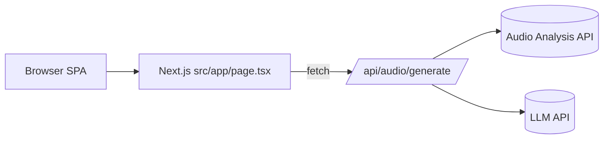

# 2. High Level Architecture

Wybór: Next.js (App Router) jako frontend + minimalny BFF (Route Handlers) w jednym repo. Single‑screen SPA bez SSR (komponenty klienckie), a BFF obsługuje sekrety API.

## 2.1. Technical Summary

- Frontend: Next.js (App Router) + TypeScript + Tailwind. Jeden ekran (`src/app/page.tsx`), komponenty klienckie dla prostoty.
- BFF: Next.js Route Handlers (`src/app/api/audio/generate/route.ts`) na Vercel do ukrycia kluczy API.
- Integracje: Music.ai (analiza audio) + LLM (generowanie tekstu).
- Prywatność: brak auth i storage (dane tymczasowe zgodnie z NFR2).
- UX: synchroniczne przetwarzanie w jednym żądaniu, status "Generowanie..." na przycisku.

## 2.2. Platform Choice

**Wybór: Next.js + Vercel (REKOMENDACJA)**

- Plusy: wbudowane API routes, łatwy deploy, ukryte klucze API
- Minusy: minimalnie większa złożoność niż czyste SPA
- Uzasadnienie: potrzebujemy ukryć klucze API przed przeglądarką

## 2.3. Repository Structure

Jedno repo Next.js (FE + BFF razem). Proste typy w `src/lib/types.ts`.

## 2.4. High Level Architecture Diagram (Mermaid)

## 2.5. Architectural Patterns

- Jamstack + minimalny BFF (Route Handlers) zamiast pełnego backendu.
- FE: proste komponenty wywołują API bezpośrednio.
- BE: podstawowy format błędów, walidacja wejścia.
- YAGNI: tylko jeden endpoint (`/api/audio/generate`).

---
