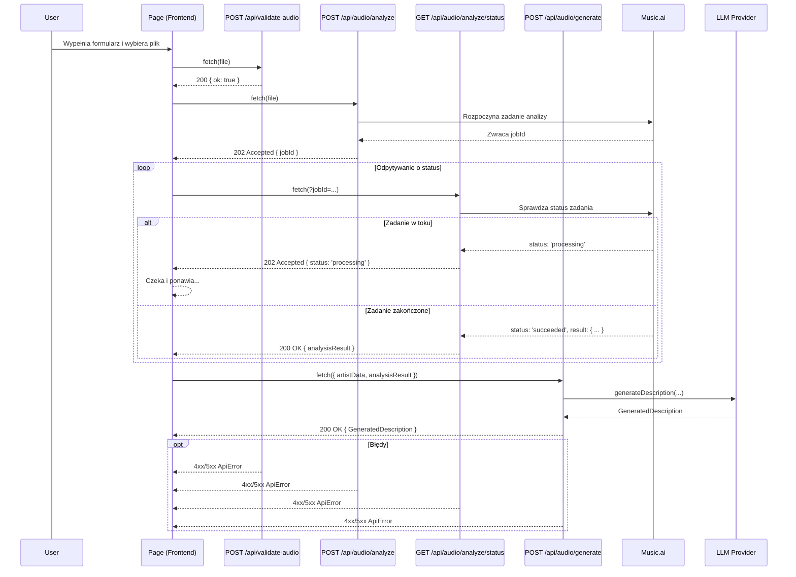
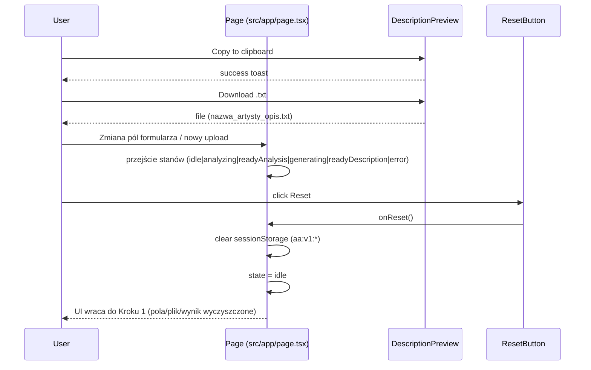

# 8. Core Workflows (Mermaid Sequence)

## 8.1 Asynchronous Generation Workflow

```mermaid
sequenceDiagram
    participant U as User
    participant P as Page (Frontend)
    participant Validate as POST /api/validate-audio
    participant Analyze as POST /api/audio/analyze
    participant Status as GET /api/audio/analyze/status
    participant Generate as POST /api/audio/generate
    participant MAI as Music.ai
    participant LLM as LLM Provider

    U->>P: Wypełnia formularz i wybiera plik
    P->>Validate: fetch(file)
    Validate-->>P: 200 { ok: true }

    P->>Analyze: fetch(file)
    Analyze->>MAI: Rozpoczyna zadanie analizy
    MAI-->>Analyze: Zwraca jobId
    Analyze-->>P: 202 Accepted { jobId }

    loop Odpytywanie o status
        P->>Status: fetch(?jobId=...)
        Status->>MAI: Sprawdza status zadania
        alt Zadanie w toku
            MAI-->>Status: status: 'processing'
            Status-->>P: 202 Accepted { status: 'processing' }
            P-->>P: Czeka i ponawia...
        else Zadanie zakończone
            MAI-->>Status: status: 'succeeded', result: { ... }
            Status-->>P: 200 OK { analysisResult }
        end
    end

    P->>Generate: fetch({ artistData, analysisResult })
    Generate->>LLM: generateDescription(...)
    LLM-->>Generate: GeneratedDescription
    Generate-->>P: 200 OK { GeneratedDescription }

    opt Błędy
        Validate-->>P: 4xx/5xx ApiError
        Analyze-->>P: 4xx/5xx ApiError
        Status-->>P: 4xx/5xx ApiError
        Generate-->>P: 4xx/5xx ApiError
    end
```

## 8.2 Copy/Download/Reset & Edit loop

```mermaid
sequenceDiagram
  participant U as User
  participant P as Page (src/app/page.tsx)
  participant D as DescriptionPreview
  participant R as ResetButton

  U->>D: Copy to clipboard
  D-->>U: success toast
  U->>D: Download .txt
  D-->>U: file (nazwa_artysty_opis.txt)

  U->>P: Zmiana pól formularza / nowy upload
  P->>P: przejście stanów (idle|analyzing|readyAnalysis|generating|readyDescription|error)

  U->>R: click Reset
  R->>P: onReset()
  P->>P: clear sessionStorage (aa:v1:*) 
  P->>P: state = idle
  P-->>U: UI wraca do Kroku 1 (pola/plik/wynik wyczyszczone)
```

---
