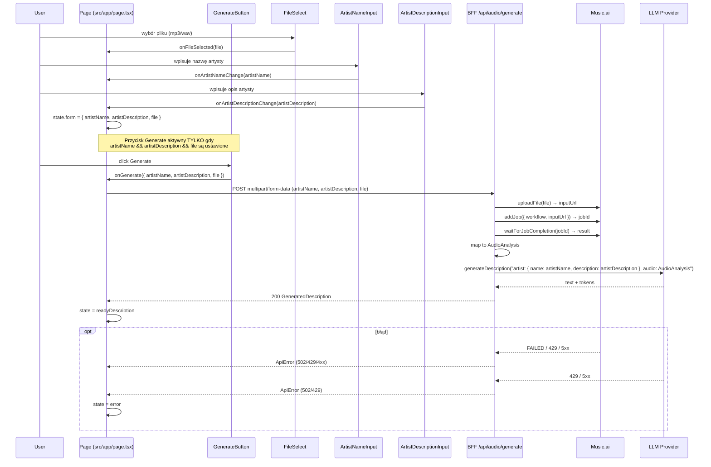
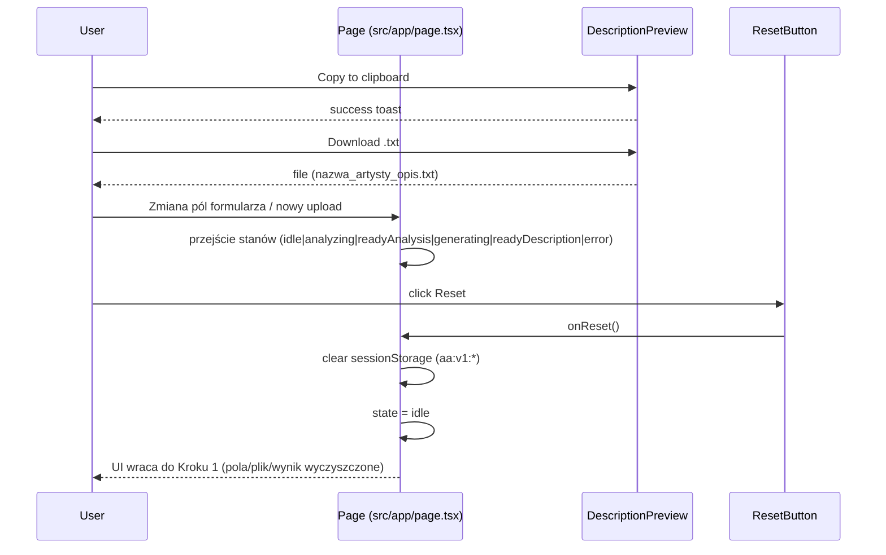

# 8. Core Workflows (Mermaid Sequence)

## 8.1 Generate Description (sync orchestration)

```mermaid
sequenceDiagram
  participant U as User
  participant P as Page (src/app/page.tsx)
  participant G as GenerateButton
  participant FU as FileSelect
  participant AN as ArtistNameInput
  participant AD as ArtistDescriptionInput
  participant API as BFF /api/audio/generate
  participant MAI as Music.ai
  participant LLM as LLM Provider

  U->>FU: wybór pliku (mp3/wav)
  FU->>P: onFileSelected(file)

  U->>AN: wpisuje nazwę artysty
  AN->>P: onArtistNameChange(artistName)

  U->>AD: wpisuje opis artysty
  AD->>P: onArtistDescriptionChange(artistDescription)

  P->>P: state.form = { artistName, artistDescription, file }

  Note over P,G: Przycisk Generate aktywny TYLKO gdy<br/>artistName && artistDescription && file są ustawione

  U->>G: click Generate
  G->>P: onGenerate({ artistName, artistDescription, file })

  P->>API: POST multipart/form-data (artistName, artistDescription, file)

  API->>MAI: uploadFile(file) → inputUrl
  API->>MAI: addJob({ workflow, inputUrl }) → jobId
  API->>MAI: waitForJobCompletion(jobId) → result
  API->>API: map to AudioAnalysis

  API->>LLM: generateDescription("artist: { name: artistName, description: artistDescription }, audio: AudioAnalysis")
  LLM-->>API: text + tokens

  API-->>P: 200 GeneratedDescription
  P->>P: state = readyDescription

  opt błąd
    MAI-->>API: FAILED / 429 / 5xx
    API-->>P: ApiError (502/429/4xx)
    LLM-->>API: 429 / 5xx
    API-->>P: ApiError (502/429)
    P->>P: state = error
  end
```

## 8.3 Copy/Download/Reset & Edit loop

```mermaid
sequenceDiagram
  participant U as User
  participant P as Page (src/app/page.tsx)
  participant D as DescriptionPreview
  participant R as ResetButton

  U->>D: Copy to clipboard
  D-->>U: success toast
  U->>D: Download .txt
  D-->>U: file (nazwa_artysty_opis.txt)

  U->>P: Zmiana pól formularza / nowy upload
  P->>P: przejście stanów (idle|analyzing|readyAnalysis|generating|readyDescription|error)

  U->>R: click Reset
  R->>P: onReset()
  P->>P: clear sessionStorage (aa:v1:*)
  P->>P: state = idle
  P-->>U: UI wraca do Kroku 1 (pola/plik/wynik wyczyszczone)
```

---
