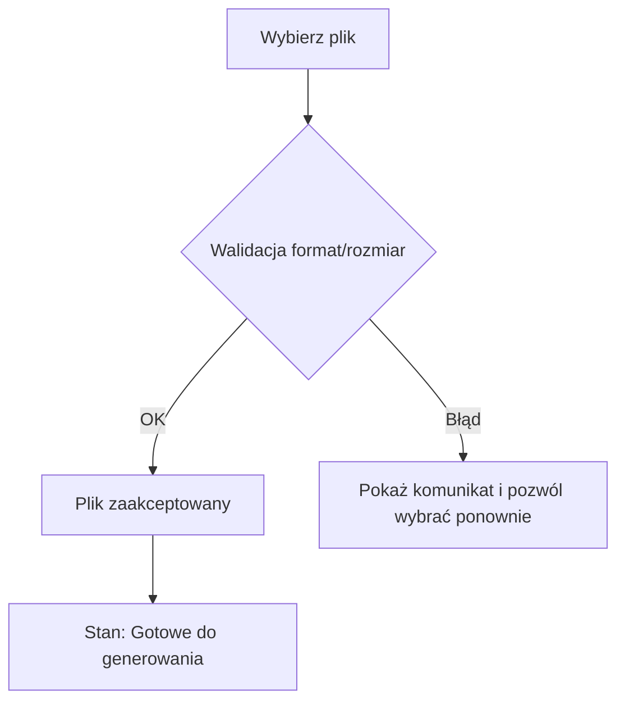
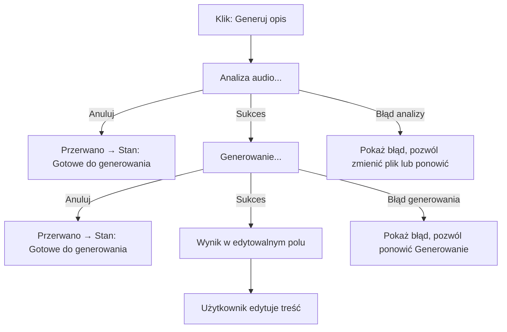
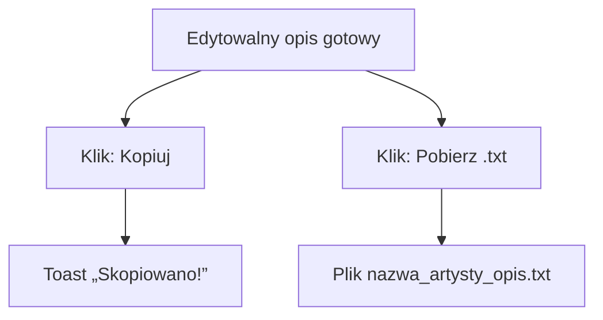

# Specyfikacja UI/UX Artist Amplifier

## Wprowadzenie

Ten dokument definiuje cele doświadczenia użytkownika, architekturę informacji, przepływy użytkownika oraz specyfikacje projektowe interfejsu użytkownika aplikacji Artist Amplifier. Stanowi on podstawę dla projektowania wizualnego i developmentu front‑end, zapewniając spójne i zorientowane na użytkownika doświadczenie.

## Kontekst i zakres

- Wizja produktu: Lekki, jednostronicowy (SPA) mechanizm, który generuje profesjonalny opis prasowy na podstawie minimalnych danych artysty i pojedynczego pliku audio (zob. `docs/brief.md`).
- Cel MVP: Szybka weryfikacja potrzeb rynku i zbieranie informacji zwrotnych od realnych użytkowników (zob. `docs/prd.md`).
- Główna persona: Niezależny muzyk lub mały zespół oczekujący szybkości, prostoty i natychmiastowych efektów bez onboardingu czy rejestracji.

## Ogólne cele UX i zasady

### Docelowe persony użytkowników

- Niezależny muzyk (główna) — szybkość, brak onboardingu, często na urządzeniach mobilnych.
- Przedstawiciel małego zespołu (drugorzędna) — podobne ograniczenia, konteksty mobilne.
- Asystent/Kierownik PR (trzeciorzędna) — potrzebuje szybkiego, spójnego wyniku; edycja przed użyciem.

### Cele użyteczności

- Czas do pierwszego opisu ≤ 5 minut.
- Kroki ≤ 4, jeden ekran (single page).
- „Generuj opis” aktywne tylko, gdy wymagane dane są poprawne.
- Ponowna próba po błędzie w ≤ 2 działaniach.
- Mobile-first od 320px; cele dotyku ≥ 44px.
- Podstawy WCAG 2.1 AA: kontrast ≥ 4.5:1, poprawne etykiety, kolejność focusu, role ARIA.

### Zasady projektowe

1.  Jasność ponad spryt — minimalne UI, jawne etykiety/stany.
2.  Stopniowe odkrywanie — tylko to, co potrzebne na danym etapie.
3.  Natychmiastowa informacja zwrotna — stan przycisku/tekstu statusu odzwierciedla fazę.
4.  Domyślnie dostępne — focus, ARIA, kontrast, wsparcie klawiatury.
5.  Edytowalny wynik — wygenerowany tekst można edytować przed kopiowaniem/pobraniem.
6.  Prostota jednego ekranu — wszystkie zadania na jednej stronie.
7.  Sterowanie przez stan — akcje aktywują się tylko po spełnieniu wymagań.

## Architektura informacji (IA) {#ia}

### Mapa strony / Inwentaryzacja ekranów

```mermaid
{{ ... }}
graph TD
    A[Single Page: Artist Amplifier (Stepper 1–4)] --> S1[1. Dane Artysty]
    A --> S2[2. Prześlij Utwór]
    A --> S3[3. Generuj i Edytuj]
    A --> S4[4. Skopiuj / Pobierz]

    %% Gating
    S1 -->|Dane poprawne| S2
    S2 -->|Plik zaakceptowany| S3
    S3 -->|Wynik wygenerowany| S4

    %% States
    S3 --> ST1[Status: Analiza audio...]
    S3 --> ST2[Status: Generowanie...]
    S3 --> ST3A[Błąd analizy]
    S3 --> ST3B[Błąd generowania]
    S3 --> ST4[Wynik: Edytowalny opis]
```

### Struktura nawigacji

- Nawigacja główna: Stepper (przyklejony u góry) z krokami 1–4; przyszłe kroki wyłączone do czasu spełnienia wymagań wstępnych.
- Nawigacja pomocnicza: Kotwice w obrębie strony do każdego kroku (deep linking).
- Okruszki (breadcrumb): Nie dotyczy (poziom pojedynczy).

## Przepływy użytkownika {#flows}

### Warunki wstępne steppera

- Krok 2 wymaga poprawnych danych z kroku 1 (nazwa + opis zwalidowane i zapisane w sesji)
- Krok 3 wymaga poprawnych danych z kroku 1 + zaakceptowany plik z kroku 2
- Krok 4 wymaga wygenerowanego wyniku

#### Bramkowanie steppera

```mermaid
graph TD
  S1[1. Dane Artysty (poprawne?)] -->|tak| S2[2. Prześlij Utwór (zaakceptowany?)]
  S2 -->|tak| S3[3. Generuj i Edytuj (wynik?)]
  S3 -->|tak| S4[4. Skopiuj / Pobierz]
```

### Przepływ 1: Wprowadzanie Danych Artysty {#flow-1}

- **Cel użytkownika:** Wprowadzić nazwę i opis artysty, aby spersonalizować opis.
- **Punkty wejścia:** Start ekranu; link z materiałów promocyjnych.
- **Kryteria sukcesu:** Oba pola zwalidowane; dane zapisane w sesji; a11y OK.
- **Stan po:** Poprawne dane w stanie sesji; brak błędów walidacji.

```mermaid
graph TD
  A[Start] --> B[Wpisz Nazwę (wymagane)]
  B --> C[Wpisz Opis (wymagane, 50–1000 znaków)]
  C --> D{Walidacja}
  D -- OK --> E[Zapis w stanie sesji]
  D -- Błąd --> C1[Pokaż komunikat i fokus na polu]
  E --> F[Gotowe do kroku 2]
```

- **Przypadki krawędziowe i błędy:** Puste/za krótkie/za długie pola → komunikaty i fokus; auto-scroll do błędnego pola; aria-describedby dla błędów; sesja utrzymuje dane po odświeżeniu; brak przewijania horyzontalnego przy 320px.
- **Notatki:** PRD 1.1 (AC 1–7).

### Przepływ 2: Przesyłanie Utworu do Analizy {#flow-2}

- **Warunki wstępne:** Flow 1 poprawny.
- **Cel użytkownika:** Wskazać plik .mp3/.wav ≤ 50MB do analizy.
- **Punkty wejścia:** Przycisk „Wybierz plik”.
- **Kryteria sukcesu:** Walidacja formatu/rozmiaru; możliwość zmiany pliku; stan „Gotowe do generowania”.
- **Stan po:** Plik zaakceptowany i gotowy dla kroku 3.



- **Przypadki krawędziowe i błędy:** Zbyt duży/nieobsługiwany format → komunikat i ponowny wybór; anulowanie wyboru → pozostaje poprzedni stan; „Zmień plik” dostępne.
- **Notatki:** PRD 1.2 (AC 1–7).

### Przepływ 3: Generowanie i Edycja Opisu {#flow-3}

- **Warunki wstępne:** Flow 1 + 2 poprawne.
- **Cel użytkownika:** Wygenerować edytowalny opis.
- **Punkty wejścia:** Klik „Generuj opis” (aktywny po spełnieniu prereq).
- **Kryteria sukcesu:** Statusy „Analiza…” → „Generowanie…”; wynik w textarea; obsługa błędów; możliwość anulowania.



- **Przypadki krawędziowe i błędy:** Timeout/dostawca → czytelny błąd i opcja ponowienia; po anulowaniu zachowaj dane i zaakceptowany plik; ponowienie tylko nieudanego etapu; ostrzeżenie przy próbie zamknięcia/odświeżenia w trakcie „Analiza…”/„Generowanie…”; użytkownik może najpierw wybrać „Anuluj”, aby opuścić.
- **Notatki:** PRD 1.3 (AC 1–7).

### Przepływ 4: Wykorzystanie Gotowego Opisu {#flow-4}

- **Cel użytkownika:** Skopiować lub pobrać opis.
- **Punkty wejścia:** Pod textarea: „Kopiuj do schowka”, „Pobierz .txt”.
- **Kryteria sukcesu:** Pełna zawartość skopiowana/pobrana; potwierdzenie akcji; zsanityzowana nazwa pliku.
- **Stan po:** Toast „Skopiowano!”; plik `nazwa_artysty_opis.txt` pobrany.



- **Przypadki krawędziowe i błędy:** Brak uprawnień do schowka → komunikat i instrukcja ręczna; sanitizacja nazwy pliku.
- **Notatki:** PRD 1.4 (AC 1–3).

### Śledzenie AC → PRD {#traceability}

- Mapowanie przepływów w tej specyfikacji na Story w `docs/prd.md`:

| Flow w spec | PRD Story | Zakres |
| :-- | :-- | :-- |
| Flow 1 — Wprowadzanie Danych Artysty | Story 1.1 | Formularz, walidacja, zapis w sesji |
| Flow 2 — Przesyłanie Utworu | Story 1.2 | Wybór/zmiana pliku, walidacja, stany analizy |
| Flow 3 — Generowanie i Edycja | Story 1.3 | Analiza → Generowanie, edycja, anulowanie, ponowienie |
| Flow 4 — Wykorzystanie Gotowego Opisu | Story 1.4 | Kopiuj, Pobierz .txt, toast sukcesu |

## Makiety (tekstowe) {#wireframes}

Opis poniżej stanowi źródło prawdy dla układu ekranów (tekstowo, bez plików graficznych).

### Ekran: Jedna strona — Desktop (≥1024px)

- Cel: Zrealizować 4 kroki na jednej stronie z jasnym gatingiem i stanami.
- Kluczowe elementy:
  - Sticky Stepper (1–4) z wyróżnieniem bieżącego kroku; przyszłe kroki wyłączone do spełnienia warunków wstępnych
  - Krok 1: Nazwa (input), Opis (textarea + licznik 50–1000, walidacja inline)
  - Krok 2: Wybór pliku (.mp3/.wav ≤ 50MB), nazwa pliku, „Zmień plik”, walidacja format/rozmiar
  - Krok 3: „Generuj opis” ze stanami: „Analiza audio…” → „Generowanie…”, przycisk Anuluj/Stop
  - Krok 3 wynik: Edytowalne textarea (duże pole), aria-live dla statusów
  - Krok 4: „Kopiuj do schowka”, „Pobierz .txt” + toast „Skopiowano!”
- Uwagi dotyczące interakcji:
  - Aktywacja ściśle zależna od warunków wstępnych (1→2→3→4)
  - Po błędach: fokus na polu/bieżącej akcji; ponowienie tylko nieudanego etapu
  - aria-describedby dla błędów, aria-live=polite dla statusów

#### Struktura treści (kolejność DOM)

1. Nagłówek: Sticky Stepper (1–4)
2. Sekcja: Krok 1 (formularz Nazwa/Opis)
3. Sekcja: Krok 2 (Wybór/Zmiana pliku, walidacja)
4. Sekcja: Krok 3 (Przycisk „Generuj opis”, status/Anuluj, textarea wyniku)
5. Sekcja: Krok 4 (Kopiuj/Pobierz, toasty)
6. Stopka: proste stopki informacyjne (opcjonalnie)

#### Landmarks i nagłówki

- `header` (Stepper), `main` (sekcje kroków), `footer`
- Hierarchia H2/H3 zgodna z sekcjami; linki-kotwice do `#flow-1..4`

#### Odstępy i wymiary (desktop)

- Szerokość treści ~960px, wyśrodkowana; marginesy boczne 24px+
- Siatka odstępów: 8/12/16/24; przyciski: wysokość ~40–44px
- Textarea wynikowa: min-wys. ~240–320px; rośnie do bezpiecznej wysokości

#### Stany

- Puste: pola formularza z hintami; brak błędów
- Ładowanie: „Analiza…/Generowanie…” + spinner; akcje konfliktowe wyłączone
- Błąd: blok błędu nad właściwym obszarem; fokus na „Ponów”/polu

##### Mikro-wireframe (ASCII) — Desktop

```text
+----------------------------------------------------------------------------------+
| [Stepper — sticky]  1 Dane  |  2 Prześlij  |  3 Generuj  |  4 Skopiuj/Pobierz    |
+----------------------------------------------------------------------------------+
| H2: Krok 1 — Dane Artysty                                                       |
| Nazwa:  [______________________________]                                        |
| Opis:   [ textarea (50–1000) ............................................... ] |
|         (licznik: 0/1000)                                                      |
|                                                                                |
| H2: Krok 2 — Prześlij Utwór                                                    |
| [Wybierz plik]   nazwa_pliku.mp3    [Zmień plik]                               |
| (Obsługiwane: .mp3, .wav; ≤50MB)                                               |
|                                                                                |
| H2: Krok 3 — Generuj i Edytuj                                                  |
| [Generuj opis]     Status: Analiza... / Generowanie...      [Anuluj]           |
| [ edytowalne textarea wyniku .............................................. ] |
|                                                                                |
| H2: Krok 4 — Skopiuj / Pobierz                                                 |
| [Kopiuj do schowka]     [Pobierz .txt]                                         |
+----------------------------------------------------------------------------------+
```

### Ekran: Jedna strona — Mobile (320–390px)

- Cel: Mobile-first, minimal scroll, stała widoczność postępu i akcji.
- Kluczowe elementy:
  - Skompaktowany sticky Stepper (1–4) u góry; cele dotyku ≥44px
  - Pola w kolumnie; etykiety nad polami; licznik znaków inline
  - Sticky pasek statusu+Anuluj podczas długich operacji (nie zasłania pól; keyboard-aware)
  - Sekcja akcji (Kopiuj/Pobierz) nie nachodzi na textarea; toasty nieblokujące
- Uwagi dotyczące interakcji:
  - Auto-scroll do pierwszego błędnego pola i fokus
  - Brak przewijania horyzontalnego przy 320px; kontrast ≥ 4.5:1

#### Struktura treści (kolejność DOM)

1. Nagłówek: skompaktowany Sticky Stepper (≥44px cele dotyku)
2. Krok 1: pola w kolumnie, etykiety nad, licznik inline
3. Krok 2: wybór pliku, nazwa pliku, „Zmień plik”, walidacja
4. Krok 3: sticky pasek statusu+Anuluj podczas długich operacji; textarea wyniku
5. Krok 4: sekcja akcji pod textarea; toasty nieblokujące

#### Landmarks i nawigacja

- `header` (Stepper), `main` (sekcje), brak zbędnych bocznych paneli
- Kotwice do kroków; powrót do zakończonych kroków dozwolony

#### Odstępy i wymiary (mobile)

- Marginesy boczne ~16px; odstępy 8/12/16
- Sticky pasek nie zasłania pól (keyboard-aware)

#### Stany

- Identyczne jak desktop, z priorytetem czytelności na małych ekranach

##### Mikro-wireframe (ASCII) — Mobile

```text
+----------------------------------------------+
| [1] [2] [3] [4]   (Stepper — sticky)         |
+----------------------------------------------+
| Krok 1 — Dane Artysty                         |
| Nazwa                                         |
| [____________________]                        |
| Opis                                          |
| [ textarea (50–1000) ]  (licznik)             |
|                                              |
| Krok 2 — Prześlij Utwór                       |
| [Wybierz plik]                                |
| nazwa_pliku.mp3    [Zmień plik]               |
|                                              |
| Krok 3 — Generuj i Edytuj                     |
| [Generuj opis]                                |
| ── sticky pasek statusu + Anuluj ──────────── |
| Status: Analiza...           [Anuluj]         |
| [ textarea wyniku ]                           |
|                                              |
| Krok 4 — Skopiuj / Pobierz                    |
| [Kopiuj]     [Pobierz .txt]                   |
+----------------------------------------------+
```

## Dostępność (WCAG 2.1 AA) {#a11y}

### Zasady i cele

- Kontrast tekstu ≥ 4.5:1; komponentów UI i stanu (np. focus, aktywny) ≥ 3:1.
- Klawiatura: Pełna obsługa bez pułapek; logiczny porządek tab; wyraźny focus-visible.
- Formularze: Widoczne etykiety; limity znaków i wskazówki opisane; błędy powiązane `aria-describedby`.
- Live regions: Statusy/komunikaty przez `aria-live="polite"` lub `role="status"`; brak skoków focusu bez potrzeby.
- Struktura: Landmarks (`header`, `main`, `footer`), semantyczne nagłówki H1–H3 zgodne z sekcjami.
- Dotyk: Cele interakcji ≥44×44px.
- Reflow/Zoom: 200% bez utraty funkcji; brak poziomego scrolla przy 320px.
- Ruch: Szanuj `prefers-reduced-motion`; brak migotania/animacji istotnych dla zrozumienia.
- Język: Atrybut `lang` (np. `pl-PL`); gotowość do i18n kopii stałych.

### Kryteria dla każdego przepływu

- Flow 1 (Dane Artysty):
  - Etykiety i opisy (nazwa, opis) jednoznaczne; licznik znaków ogłaszany; limity opisane.
  - Walidacja inline: komunikat błędu powiązany przez `aria-describedby`; auto-scroll + fokus na polu.
- Flow 2 (Przesyłanie utworu):
  - Pole pliku opisane (akceptowane formaty/rozmiar) w tekście, nie tylko w atrybucie accept.
  - Błędy formatu/rozmiaru ogłaszane; przycisk „Zmień plik” dostępny z klawiatury.
- Flow 3 (Generowanie i Edycja):
  - Statusy „Analiza…”/„Generowanie…” ogłaszane przez `aria-live`/`role="status"`.
  - „Anuluj/Stop” fokusowalny; po anulowaniu zachowaj fokus na najbliższej akcji.
  - Po błędzie: komunikat opisowy, fokus na przycisku „Ponów” lub odpowiednim polu.
  - Ochrona przed zamknięciem/odświeżeniem w trakcie operacji; ostrzeżenie z opcją anulowania.
- Flow 4 (Kopiuj/Pobierz):
  - Nazwy dostępności dla przycisków; toast sukcesu ogłaszany (polite) i nieblokujący.
  - Nazwa pliku zsanityzowana i komunikowana w tekście.

### Plan testów (ręczne + automatyczne)

- Klawiatura: kompletna ścieżka 1→4; widoczny focus; brak pułapek.
- Czytniki ekranu: NVDA/VoiceOver — odczyt etykiet, błędów, statusów live, toasta.
- Mobile: TalkBack — dostępność elementów dotykowych i sticky pasków.
- Kontrast: weryfikacja kolorów dla tekstu i komponentów (≥4.5:1 / ≥3:1).
- Automaty: axe DevTools/Lighthouse — 0 krytycznych błędów dostępności.
- Unload protection: podczas długich operacji (Analiza/Generowanie) wyświetla się ostrzeżenie przed zamknięciem/odświeżeniem; weryfikuj czytelność, brak utraty danych i możliwość kontynuacji.

### Lista akceptacyjna

- [ ] Wszystkie akcje dostępne z klawiatury; focus-visible konsekwentny.
- [ ] Etykiety i błędy formularzy powiązane i ogłaszane.
- [ ] Statusy async ogłaszane przez aria-live/role=status; nie przerywają pracy.
- [ ] Brak poziomego scrolla przy 320px; 200% zoom OK.
- [ ] Kontrast spełnia progi WCAG; cele dotyku ≥44×44.

## Biblioteka komponentów / System projektowy {#design-system}

### Komponenty (atomy/molekuły)

- Button
  - Warianty: primary, secondary, ghost; Rozmiary: md (domyślny)
  - Stany: default, hover, focus-visible, active, disabled, loading
  - Zawartość: etykieta; opcjonalny spinner (loading). A11y: role=button, aria-busy podczas ładowania
- Input (text) / Textarea
  - Z etykietą, pomocą i błędem; licznik dla textarea (50–1000)
  - Stany: default, focus-visible, error, disabled
  - A11y: label for/id; aria-describedby łączy pomoc/błąd; ogłaszaj zmiany licznika
- FileInput
  - Accept: .mp3,.wav; Max: 50MB; pokazuje nazwę pliku; akcja „Zmień plik”
  - Stany: idle, validating, accepted, error
  - A11y: dostępne z klawiatury; komunikaty błędów ogłaszane; jasne wskazówki dot. formatów/rozmiaru
- Stepper
  - Kroki 1–4 ze stanami: disabled, active (aria-current=step), completed
  - Możliwość powrotu do ukończonych kroków; przyszłe kroki wyłączone do spełnienia warunków wstępnych
- StatusBanner / Progress
  - Pokazuje „Analiza…”, „Generowanie…”, błędy; opcjonalny spinner
  - A11y: role="status" lub aria-live="polite"; nieblokujące
- Toast
  - Typy: success, error; auto‑zamykanie 3–5 s; ręczny przycisk zamknięcia
  - A11y: aria-live=polite; nie przejmuje fokusu
- SectionHeader
  - Tytuł + opcjonalny opis; kotwice do głębokich linków
- FormField (wrapper)
  - Standaryzuje etykietę, pomoc, błąd, odstępy i układ

### Stany i interakcje
- Traktowanie focusu: 2px kontur o wysokim kontraście; respektuje prefers-contrast
- Zasady ładowania: wyłącz kolidujące akcje; pokaż spinner + tekst statusu
- Zasady błędów: inline, konkretne; ścieżki odzyskiwania (ponów, zmień plik) per flow

### Tokeny projektowe (role, nie finalne heksy)

- Role kolorów: surface, surface-elev, text-primary, text-secondary, accent, accent-contrast, success, warning, error, border
- Skala odstępów: 4, 8, 12, 16, 24, 32
- Promienie: 6, 10
- Cienie: sm, md (niekrytyczne; respektuj reduced-motion dla animowanych cieni)
- Typografia: Bazowa 16px; Skala 12, 14, 16, 18, 20, 24, 32; Wagi 400/600

### QA / Testy

- Viewporty: 320, 360, 390, 768, 1024; portret/pejzaż; zoom 200%
- Scenariusze: błędy analizy/generowania, anulowanie, ponowienie, brak schowka
- Lighthouse Mobile ≥90; brak poziomego scrolla przy 320px

### Mechanizmy dostępności

{{ ... }}
- Każdy element interaktywny: dostępny z klawiatury, widoczny fokus, poprawne name/role/value
- aria-describedby łączy pomoc/błąd; aria-live lub role=status dla stanów asynchronicznych
- Pole pliku ma jasne instrukcje dla czytników ekranu (format, rozmiar). Toasty ogłaszane grzecznie

### Test Hooks (data-testid i role) {#test-hooks}

- Przycisk „Generuj opis”: `data-testid="generate-button"`
- Przycisk „Anuluj”: `data-testid="cancel-button"`
- Pasek statusu: `role="status"`, `aria-live="polite"`, `data-testid="status-banner"`
- Pole pliku: `data-testid="file-input"`
- Przycisk „Ponów” (analiza/generowanie): `data-testid="retry-analyze"` / `data-testid="retry-generate"`
- Textarea wyniku: `data-testid="result-textarea"`
- Przyciski „Kopiuj”/„Pobierz .txt”: `data-testid="copy-button"` / `data-testid="download-button"`
- Stepper: `data-testid="stepper"`; aktywny krok z `aria-current="step"`

### Kontrakt implementacyjny (przekazanie do dev)

- Zdarzenia: onGenerate, onCancel, onRetry, onCopy, onDownload, onFileChange
- Semantyka zdarzeń: onCancel może wystąpić w fazie 'analyze' lub 'generate'; callback onCancel({ phase: 'analyze' | 'generate' })
- Powierzchnia walidacji: zwraca { valid: boolean, errors: {field: message} }
- i18n: wszystkie teksty widoczne dla użytkownika przez słownik messages; język strony ustawiony na pl-PL

## Stany (pusty/ładowanie/błąd) {#states}

### Puste stany

- Aplikacja po starcie: kroki 2–4 nieaktywne; copy kontekstowe zachęcające do uzupełnienia Krok 1.
- Krok 1: pola puste z krótkimi hintami (placeholder/description), licznik znaków 0/1000.
- Krok 2: brak wybranego pliku → komunikat o akceptowanych formatach/rozmiarze.
- Krok 3: brak wyniku do edycji do czasu powodzenia generowania.

Przykłady copy:

- Krok 1: „Podaj nazwę i krótki opis artysty (50–1000 znaków).”
- Krok 2: „Wybierz plik .mp3 lub .wav (≤ 50MB).”

### Copy checklist (stany i komunikaty) {#copy-checklist}

- Każdy komunikat ma tytuł + krótki opis + jasną akcję naprawczą.
- Unikaj żargonu; jeśli konieczny (np. timeout), dodaj proste wyjaśnienie.
- CTA w trybie rozkazującym i konkretne (np. „Ponów analizę”, „Zmień plik”).
- Toasty: nieblokujące, auto‑zamykanie 3–5 s, możliwość ręcznego zamknięcia.
- Komunikaty stanów mówią „co dalej” (kolejny krok lub akcja).
- Schowek: pokaż fallback (zaznacz + Ctrl/Cmd+C) przy braku uprawnień.

### Stany ładowania

- Analiza → „Analiza audio…” z nieblokującym `role="status"`/`aria-live="polite"`; spinner.
- Generowanie → „Generowanie…” analogicznie; brak skoków layoutu; CTA konfliktowe wyłączone.
- Mobile: sticky pasek statusu + „Anuluj”; nie zasłania pól (keyboard-aware).
- Unload-protection: ostrzeżenie przy zamknięciu/odświeżeniu trwającej operacji (Analiza/Generowanie).

### Stany błędu

- Błąd analizy (Flow 3):
  - Tytuł: „Nie udało się przeanalizować pliku.”
  - Treść: krótka przyczyna, instrukcja naprawy (np. format/rozmiar).
  - Akcje: „Zmień plik”, „Ponów analizę”. Fokus na akcji naprawczej.
- Błąd generowania (Flow 3):
  - Tytuł: „Nie udało się wygenerować opisu.”
  - Treść: spróbuj ponownie; dane z Kroków 1–2 pozostają.
  - Akcje: „Ponów generowanie”, „Anuluj”.
- Brak uprawnień do schowka (Flow 4):
  - Tytuł: „Nie można skopiować do schowka.”
  - Treść: pokaż instrukcję ręczną (zaznacz + Ctrl/Cmd+C).
- Timeout/dostawca: jasny komunikat + bezpieczne ponowienie tylko dla nieudanego etapu.

### A11y dla stanów

- Statusy: `aria-live="polite"` lub `role="status"`; nie przejmują focusu.
- Błędy: opisowe, powiązane przez `aria-describedby`; auto-scroll i fokus na akcji.
- `onCancel({ phase })` dostępne z klawiatury; po anulowaniu fokus wraca do najbliższej sensownej akcji.

### Lista akceptacyjna

- [ ] Empty: jasne wskazówki co dalej na każdym kroku; brak mylących CTA.
- [ ] Loading: brak CLS; CTA konfliktowe wyłączone; status ogłaszany SR.
- [ ] Error: komunikat z przyczyną i instrukcją naprawy; focus na akcji naprawczej.
- [ ] Ponowienie tylko dla nieudanego etapu (analiza vs generowanie).
- [ ] Unload-protection działa podczas Analiza/Generowanie.

## Branding i przewodnik stylu {#branding}

### Esencja marki i ton

- Ton: przyjazny, konkretny, pewny; bez żargonu technicznego.
  {{ ... }}
- Głos: pomocny, nastawiony na szybki efekt; etykiety akcji w trybie rozkazującym (np. „Generuj opis”).
- Język UI: PL (domyślnie), gotowość do i18n; zwięzłe komunikaty błędów.

### System kolorów (role, nie finalne heksy)

- Primary Accent: do przycisków głównych i aktywnych stanów.
- Surface / Surface-Elevated: tła sekcji i podniesionych kart.
- Text Primary/Secondary: kontrast odpowiednio wysoki/średni.
- Feedback: Success, Warning, Error; Border do konturów i rozdzielenia.
- Kontrast: tekst ≥ 4.5:1; elementy interaktywne/stany ≥ 3:1.
- Nie stosować jasnego tekstu na akcencie bez zachowania kontrastu.

### Typografia

- Preferencja: Inter, system-ui, -apple-system, Segoe UI, Roboto, „Helvetica Neue”, Arial, sans-serif.
- Skala (bazowa 16px): 12, 14, 16, 18, 20, 24, 32; wagi 400/600.
- Zastosowanie: H1 (32/600), H2 (24/600), H3 (20/600), Body (16/400), Small (14/400).

### Odstępy i układ

- Siatka odstępów: 4, 8, 12, 16, 24, 32 (spójna z tokenami).
- Max szerokość treści: ~960px desktop; marginesy boczne 16px mobile.
- Promienie: 6/10; cienie: sm/md (subtelne, bez migotania).

### Ikony i grafiki

- Ikony tylko dla jasności (np. plik/muzyka, sukces/błąd); bez nadmiaru metafor.
- Ilustracje opcjonalne, płaskie, niskokontrastowe tła; brak zdjęć stockowych o krzykliwej estetyce.

### Wytyczne copywritingu

- Etykiety przycisków: czasowniki („Wybierz plik”, „Generuj opis”).
- Błędy: konkretne, z instrukcją naprawy; unikać „wystąpił błąd” bez kontekstu.
- Statusy: krótkie („Analiza audio…”, „Generowanie…”); toasty nieblokujące.

### Logo i zasoby marki

- Logo: TBD (link/plik); wersje na jasnym/ciemnym tle; minimalny rozmiar 24px wysokości.
- Tokeny i style (kolor/typografia/spacing) utrzymywane w repo (bez Figma).

### Przykłady — Rób/Nie rób

- Rób: „Generuj opis” (konkretna akcja), wyraźny focus, kontrast ≥ 4.5:1.
- Nie rób: „Kliknij tutaj”, ściana tekstu bez nagłówków, ikony bez etykiet.

## Strategia responsywności {#responsiveness}

### Progi (mobile-first)

- Bazowy: 320–767px (główny cel)
- Tablet: 768–1023px (opcjonalnie układ warstwowy → dwukolumnowy tam, gdzie ma sens)
- Desktop: ≥1024px (komfortowa szerokość treści ~960px)
- Szeroki: ≥1280px (maksymalna szerokość treści, wyśrodkowanie; bez dodatkowych kolumn)

### Zachowanie układu

- Stepper: skompaktowany na mobile (etykiety mogą się skracać); pełne etykiety na desktopie.
- Formularze: jedna kolumna na mobile; ciaśniejsze odstępy; etykiety nad polami.
- Status/Anuluj: sticky pasek na mobile podczas długich operacji; na desktopie inline.
- Akcje (Kopiuj/Pobierz): widoczne bez nachodzenia na textarea; zawijają się w razie potrzeby.
- Textarea: rośnie pionowo do bezpiecznej wysokości widoku; następnie wewnętrzny scroll; zachowuje fokus.
- Nazwy plików: skracane w środku wielokropkiem; pełna wartość przez title i tekst tylko dla SR.

### Gęstość i dotyk

- Cele dotyku ≥44×44px na mobile; w razie potrzeby skala odstępów zmniejszona o jeden stopień.
- Unikaj przewijania horyzontalnego przy 320px. Treść reflow; siatki bez stałych szerokości.

### Wydajność i zasoby

- Brak ciężkich obrazów; tylko ikony wektorowe. Odłóż ładowanie niekrytycznego JS/CSS.
- Szanuj reduced motion; unikaj paralaksy i kosztownych animacji.

### Macierz testów

- Viewporty: 320, 360, 390, 768, 1024.
- Orientacja: portret/pejzaż (mobile).
- Zoom/Reflow: 200% desktop; upewnij się, że nie ma utraty treści; weryfikacja klawiaturą + SR.

### Lista akceptacyjna

- [ ] Brak poziomego scrolla przy 320px; treść czytelna.
- [ ] Stepper czytelny i dostępny w każdej szerokości.
- [ ] Sticky status+Anuluj nie zasłania pól na mobile (keyboard-aware).
- [ ] Działają: Kopiuj/Pobierz na małych ekranach bez kolizji z textarea.
- [ ] Teksty i nazwy plików poprawnie się skracają; pełna treść dostępna SR.

## Animacje i mikrointerakcje {#animation}

### Zasady

- Subtelność, informacyjność, brak przeszkadzania. Animacje nie blokują interakcji.
- Szanuj `prefers-reduced-motion`; oferuj alternatywę statyczną.

### Skala ruchu (czasy i krzywe)

- Czasy: 120ms (hover/focus), 180ms (press/release), 240ms (toast/status), 300ms (odsłonięcie sekcji)
- Krzywe łagodzenia: standard `ease-out` na wejście, `ease-in` na wyjście; systemowe preferencje respektowane

### Przypadki użycia

- Button
  - Hover: lekka zmiana tła/cienia (120ms)
  - Active: wciśnięcie (elevation->0, 180ms)
  - Loading: spinner obok labelu + `aria-busy` (bez skoków layoutu)
- Stepper
  - Zmiana kroku: podświetlenie bieżącego, płynne przejście underline (180ms); brak przesuwania treści
- Status/Postęp
  - Pojawienie komunikatu „Analiza…/Generowanie…” fade-in (200–240ms), spinner liniowy/okrągły
  - Błędy: reveal bloku błędu (200ms), bez drastycznych skoków
- Toast
  - Wejście z dołu (translateY 8px + fade-in 240ms), auto-dismiss 3–5s, focus niekradziony
- Walidacja formularza
  - Scroll do pierwszego niepoprawnego pola (smooth, 240ms), krótki highlight obramowania (1.5s)

### Dostępność i ograniczony ruch

- Przy `prefers-reduced-motion`: animacje skrócone do 0–80ms lub wyłączone; brak parallax/ciągłych efektów
- Wszystkie komunikaty dostępne przez `aria-live`/`role=status`; brak migotania

### Ograniczenia wydajności

- Używaj właściwości GPU-friendly (opacity, transform). Unikaj layout thrash (top/left, height)
- Batchuj zmiany (requestAnimationFrame), limituj cienie/blur

### Lista akceptacyjna

- [ ] Brak skoków layoutu przy stanach (CLS≈0)
- [ ] `prefers-reduced-motion` respektowane we wszystkich przypadkach
- [ ] Spinner/Status ma tekst alternatywny i nie przejmuje focusu
- [ ] Toast nie zasłania krytycznych akcji; można szybko zamknąć

## Rozważania wydajnościowe {#performance}

### Docelowe metryki (MVP)

- TTI ≤ 2.5s (Slow 4G, mid-tier device, cold cache)
- LCP ≤ 2.5s, CLS ≤ 0.05
- INP ≤ 200ms (interakcje: klik „Generuj opis”, nawigacja stepper)
- TBT (desktop) ≤ 200ms

### Budżety zasobów (pierwsze wejście)

- JavaScript ≤ 150KB gz (initial); moduły opcjonalne ładowane on-demand
- CSS ≤ 50KB gz (critical CSS małe; reszta async)
- Fonts: ≤ 2 pliki; `font-display: swap`; fallback systemowy
- Obrazy: brak ciężkich; ikony wektorowe; brak bibliotek ikon ważących >30KB
- Audio pliki są WYŁĄCZNIE uploadowane przez użytkownika (nie w paczce)

### Taktyki

- Bundling/Minification: tree-shaking, minify, deduplicate deps
- Loading: `defer`/`async` dla JS; critical CSS inline (mała porcja), reszta `media`/async
- Code-splitting: rozdziel komponenty generatora/statusu; ładuj krok 3 dopiero po spełnieniu prereq
- Fonts: preload tylko jeśli realny zysk; `font-display: swap`; preferuj system-ui
- Caching: `Cache-Control: public, max-age=31536000, immutable` dla fingerprintowanych assetów
- Kompresja: brotli/gzip w serwie; unikaj inline base64 dużych zasobów
- Unikaj ciężkich obliczeń w kliencie; brak przetwarzania audio po stronie UI (deleguj do backendu)
- Unikaj thrashingu layoutu; używaj transform/opacity; batchuj przez rAF

### Monitorowanie i narzędzia

- Lighthouse (Mobile, Throttling): Performance ≥ 90
- Web Vitals (prod): LCP, CLS, INP wysyłane próbkująco (np. `web-vitals`)
- CI: raport Lighthouse przy PR (opcjonalnie); budżety wymuszane skryptem

### Plan testów

- Profile pod obciążeniem: Slow 4G + 4× CPU Throttle, Moto G4/Equiv
- Sprawdź: interakcje (klik „Generuj opis”), responsywność pola edycji, toasty
- Weryfikuj: brak CLS przy zmianach stanów; czasy LCP/INP w granicach

### Lista akceptacyjna

- [ ] Lighthouse Mobile ≥ 90; LCP ≤ 2.5s; CLS ≤ 0.05; INP ≤ 200ms
- [ ] JS ≤ 150KB gz i CSS ≤ 50KB gz dla pierwszego ekranu
- [ ] Brak ciężkiego przetwarzania po stronie klienta (audio)
- [ ] Assety statyczne z długim cache + fingerprint

## Kolejne kroki / Lista przekazania {#handoff}

### Artefakty do przekazania

- Biblioteka komponentów + tokeny (role, nie finalne heksy)
- Lista stringów i i18n (pl-PL, gotowość do tłumaczeń)

### Gotowość do developmentu

- Single-page ze stepperem 1–4; gating jak w `#flows`
- Krok 1: wymagane pola, limity, `aria-describedby`, licznik znaków
- Krok 2: `.mp3/.wav`, ≤50MB, błąd/ponów, „Zmień plik”
- Krok 3: „Analiza…”/„Generowanie…”, `onCancel({ phase })`, ponowienie per etap, unload protection
- Krok 4: Kopiuj/Pobierz, sanityzacja nazwy pliku, toasty sukcesu

### Dostępność (WCAG 2.1 AA)

- Pełna klawiatura + widoczny focus; poprawne name/role/value
- Statusy przez `aria-live`/`role=status`; błędy powiązane; cele ≥44×44px
- Reflow 200% bez utraty treści; kontrast spełnia progi
- Testy: NVDA/VoiceOver/TalkBack; axe; brak krytycznych błędów

### Wydajność

- Budżety: JS ≤150KB gz, CSS ≤50KB gz
- Web Vitals: LCP ≤2.5s, INP ≤200ms, CLS ≤0.05
- Code-splitting, defer/async, cache headers, kompresja (br/gz)

### System projektowy

- Tokeny (kolor/spacing/typografia/radius/shadow) zaimplementowane
- Stany: hover/focus/active/disabled/loading/error/success
- Reduced motion respektowane (`prefers-reduced-motion`)

### Kontrakty komponentów

- Zdarzenia: onGenerate, onCancel({ phase: 'analyze' | 'generate' }), onRetry, onCopy, onDownload, onFileChange
- Walidacja: `{ valid: boolean, errors: { [field]: message } }`
- i18n: wszystkie stringi z `messages`; `lang` ustawione na `pl-PL`

### QA / Testy

- Viewporty: 320, 360, 390, 768, 1024; portret/pejzaż; zoom 200%
- Scenariusze: błędy analizy/generowania, anulowanie, ponowienie, brak schowka
- Lighthouse Mobile ≥90; brak poziomego scrolla przy 320px

### Otwarte pozycje

- Materiały wizualne (opcjonalnie) — TBD
- Logo/brand assets: TBD

### Akceptacja przekazania

- [ ] UX review

### Dziennik zmian

| Data       | Wersja  | Opis                                   | Autor  |
| :--------- | :------ | :------------------------------------- | :----- |
| 2025-08-26 | v0.1.0  | Pierwsza wersja specyfikacji front‑end | Rafał  |
